**[Dokument på Norsk](docs/Norwegian.md)**

# AI assistance

This project was built with help from AI tools (Cursor). The author has a
neurological condition related to dyscalculia that makes programming harder in a
way similar to how dyscalculia makes maths harder. AI was used to turn design
ideas into working code and docs. The author still chose the product rules,
reviewed the work, and ran the testing.
It is written in rust,so as many as standard crates are used. The AI assistant has written minimum of code to "tie" them together.
The crates used in the project is listed here:
https://github.com/Supermagnum/Navi/blob/main/docs/crates.md


# Testers wanted

We need people to try Navi on **real devices** — car head units, tablets, and
phones. Reference checks so far: Samsung Galaxy Tab S6 Lite (**SM-P613**) and
Google Pixel 9a (**tegu**, phone cutout / API 36+). Cars and other shapes still
differ for GPS, maps, GPU, and layout. Checklist:
[`docs/real-hardware-testing.md`](docs/real-hardware-testing.md).
On-device and emulator results:
[`docs/android-test-results.md`](docs/android-test-results.md).
How to help: [`docs/CONTRIBUTING.md`](docs/CONTRIBUTING.md).

## Table of contents

1. [What this is](#what-this-is)
2. [Support Navi](#support-navi)
3. [Features](#features)
   - [What you need to download](#what-you-need-to-download)
   - [Indexing (background after download)](#indexing-background-after-download)
   - [Leaving a downloaded region](#leaving-a-downloaded-region)
   - [How to use](#how-to-use)
   - [How features work](#how-features-work)
4. [Settings](#settings)
5. [Break timer vs trip ETA](#break-timer-vs-trip-eta)
6. [Routing safety](#routing-safety)
7. [Minimum hardware and storage](#minimum-hardware-and-storage)
8. [Screenshots](#screenshots)
9. [Documents](#documents)
10. [Plugins](#plugins)
11. [Coding standards and contributing](#coding-standards-and-contributing)
12. [Building and installing](#building-and-installing)
    - [Install a prebuilt APK](#install-a-prebuilt-apk)
    - [Release build (APK / AAB)](#release-build-apk--aab)
13. [Where the map data comes from](#where-the-map-data-comes-from)
14. [Known issues](#known-issues)
15. [TODO](#todo)

More detail lives in linked docs (architecture, truck rest rules, map styles,
debugging, and so on). Start with [`docs/CONTRIBUTING.md`](docs/CONTRIBUTING.md) if you
want to help.

# What this is

**Navi** is an offline-first navigation app. You download map data once, then
plan routes on the device without needing the internet for every trip.

It can:

- Plan routes for car, bicycle, e-bike, hiking, motorcycle, truck, and motorhome
- Prefer gentler / less energy-hungry roads when **eco mode** is on (hills matter)
- Suggest rest stops and overnight places along longer trips
- Respect truck driving-time rules where it knows the country rules
- Show a simple map with your route, turns, and place names

The map picture on screen comes from MapLibre. Online it can use OpenFreeMap
Liberty tiles; offline it uses a downloaded regional map file (Protomaps).
Routing uses a separate OpenStreetMap extract you download in **Tools** — that
is the “brain” for finding roads and paths, not just the pretty map.

License: see `LICENSE` (GPL-3.0-or-later unless noted). Many small icons are
from Navit (**GPL v2**); see [`docs/icons.md`](docs/icons.md).

# Support Navi

Navi is free and open source, developed independently. If you'd like to
support its development, donations are welcome via direct bank transfer:

- **IBAN:** NO02 1802 0334 084
- **BIC/SWIFT:** SHEDNO22

Please include "Navi donation" as the payment reference/message, so it's
identifiable on your statement.

This is entirely optional support, not a paywall — Navi is and will remain free.

# Features

| Feature | In plain words | Status |
|---|---|---|
| **Travel modes** | Choose car, bike, e-bike, hiking, motorcycle, truck, or motorhome. | Done |
| **Vehicle size** | Save height/width/length/weight limits so the route skips roads that are too tight. | Done |
| **E-bike specs** | Battery size, motor torque, and wheel size help estimate battery use and steep climbs. Live cable telemetry is planned later. | Done (planning); live data later |
| **Avoidances** | You can ask to avoid motorways (not trunk/primary), tolls, or ferries. | Done |
| **Official trails** | For hiking/cycling, optionally prefer marked long-distance trails (off by default). Normal paths still work if the marked trail has a gap. | Done |
| **Eco routing** | Prefer routes that use less energy by taking hills into account. A small leaf icon shows when eco is on. | Done |
| **Offline planning** | Download a region once, then plan and see the route on the device. | Done |
| **Indexing** | After a region download, a background job turns the OSM extract into compact routing packs so later plans are fast. You can plan while it runs. | Done |
| **Place search** | Search places and set From / Via / To. | Done |
| **Use GPS** | Fill From / Via / To from the live fix (nearby name within ~12 m, else coordinates). The field is the chip active when you tap — not whichever chip is selected after resolution finishes. | Done |
| **Map mark & saved places** | Hold on the map ~4 s to mark a point; set From / Via / To or save a named place (separate from Saved routes). | Done |
| **Off-route / reroute** | Sustained deviation shows **Off route**; motor profiles auto-replan from the live position (resolved start label); hiking prompts first. | Done |
| **Breaks & rest** | Reminds you when a break is due and can suggest stops. Cars use hours between breaks; hiking/cycling use rest distances; trucks use legal driving-time rules where known. | Done |
| **Drive bars** | Top: altitude (cutout-aware padding). Bottom: zoom, live GPS speed, posted limit when known, break timer, trip ETA, current street, eco leaf. | Done |
| **GPS follow** | Map follows you by default. Pan away, then tap **Recenter**. | Done |
| **Map rotation** | North-up, compass, or direction of travel. | Done |
| **Moving icons** | Can draw nearby tracked markers on the map. A live radio feed is not built in yet. | Partial |
| **Seasonal road closures** | OSM `motor_vehicle:conditional` / `access:conditional` hard-filtered against the planned departure time (Car/Truck honour it; Hiking/Bicycle do not). Verified on Friisvegen (way `361797686`) on both bbox/PBF fallback and pack-hit (graph pack **v3**). Purely OSM-tag-driven — no jurisdiction pack. **v1 limitation:** multi-day trips that cross a season boundary are evaluated only at the planned departure instant (not re-evaluated day-by-day along the trip). | Done |
| **Norwegian road-sign warnings** | Vendored `NO:` catalogue approach icons in Norway; explicit OSM `traffic_sign` / `hazard` tags. **Children-zone proximity fallback** when no tagged sign exists: schools, kindergartens, and playgrounds within 200 m of the route corridor surface generic sign **142** (same 750/150/25 m phases as maneuvers). See [`docs/road-signs.md`](docs/road-signs.md). | Done |
| **Speed camera warnings** | Point cameras use the existing approach distance-phase UX; average-speed / section-control zones use a distinct enter/exit box. `maxspeed:conditional` is evaluated against live local time. Jurisdiction-gated like EC561 / allemannsretten: Norway/UK opt-in (OSM-sourced, may be incomplete); Germany/France/Switzerland and unknown jurisdictions decline — see [`docs/jurisdiction-rules.md`](docs/jurisdiction-rules.md). First-run opt-in dialog required (not silently enabled). | Done (display/warning only — no route-avoidance toggle, by deliberate product decision) |
| **Map updates** | Only when you ask — check for OpenStreetMap updates or download a fresh region. Never silent. On-screen copy is plain language (no internal planner dumps). | Done |
| **Cross-region / cross-country prompts** | Destinations outside downloaded data (including another country, e.g. Sweden) show **Map data needed** with the correct Geofabrik extract — not a silent partial route. Evidence: [`android-test-results.md` Item 10](docs/android-test-results.md#item-10--osm-update-copy-cross-region-prompts-expanded-catalog-2026-08-19). | Done |
| **Diagnostic logging** | Tools toggle writes a session log (GPS, camera, toggles, route plan/stages, eco, POIs, pauses, instructions, fuel, system) you can copy over USB/MTP — no adb required. Files: **Internal storage → Documents → debug** (`navi_session_*.log`). | Done |
| **Plugins** | A safe sandbox for future add-ons exists; product plugins are not shipped yet. | Host ready |

**Hardware note:** Real-device checks include Samsung Galaxy Tab S6 Lite
(**SM-P613**) and Google Pixel 9a. Car head units still need more real-world
testing before treating this as ship-ready. See [Screenshots](#screenshots),
[`docs/real-hardware-testing.md`](docs/real-hardware-testing.md), and
[`docs/android-test-results.md`](docs/android-test-results.md).

## What you need to download

Nothing useful ships pre-loaded. Use **Tools** in the app (with internet), then
you can go offline.

| Download | Need it? | What it is | Button in Tools |
|---|---|---|---|
| **Map region (roads & places)** | **Yes** for routing and search | OpenStreetMap extract from [Geofabrik](https://download.geofabrik.de/) (example path: `europe/norway/ostlandet`) | **Download region + build place index** |
| **Elevation** | Strongly recommended for eco / hills | Height data for the area | Usually comes with region provision |
| **Offline basemap** | Needed for map graphics without internet | Visual map tiles (Protomaps) | **Download basemap (PMTiles)** |
| **3D terrain** | Optional | Extra height tiles for hillshade | **Download terrain DEM (Mapterhorn)** |
| **OSM updates** | Optional | Fresher roads/POIs | **Check for OSM updates** (never automatic) |

**Minimum to plan a route:** region download + place index.  
**Minimum for a usable offline map picture:** that plus basemap PMTiles (or stay
online for Liberty).  
Prefer a **region** (not a whole huge country) on tablets with limited RAM —
see [Minimum hardware and storage](#minimum-hardware-and-storage).

After the region file is on disk, Navi **indexes** it in the background so later
plans are fast — see [Indexing (background after download)](#indexing-background-after-download).

## Indexing (background after download)

When **Download region + build place index** has saved the OpenStreetMap
extract, Navi starts a **background indexing** job. That is not the map picture
on screen (basemap tiles) and not the raw `.osm.pbf` file itself — it is a
one-time conversion of that extract into compact **indexed packs** the planner
can load quickly instead of scanning the whole extract on every trip.

You can search and tap **Plan route** as soon as the download finishes. Until
indexing is done, planning uses the slower raw `.osm.pbf` path. Tools shows
progress as **Indexed maps (background)**; when it says **Indexed maps: ready
(pack-hit)**, the next plan uses the packs — typically about 1.5–2 seconds on
the reference tablet instead of tens of seconds.

What the background job writes:

| Pack | What it is for |
|---|---|
| **Road / path graph** | The network A* follows, per travel mode (car, foot, bicycle, and so on). Large regions are split into spatial tiles so a 4 GB-class device does not have to hold the whole region in RAM at once. |
| **POIs and barriers** | Huts, rest stops, lodgings, overnight buildings, glacier polygons, and similar features used for rest / overnight planning and hiking safety filters. |
| **Wetland** | Marsh and water polygons hiking uses to stay out of bogs (boardwalks stay on the graph). |

A separate **place index** (names for From / Via / To search) is built as part
of the download button, before this background job starts.

If packs are missing, stale, or still converting, planning still works via the
PBF fallback. Rebuild from a file already on the device with **Rebuild indexed
maps (local PBF, background)** — no re-download. More detail:
[`docs/indexed-map-format-plan.md`](docs/indexed-map-format-plan.md). Memory
margin on lower-end 4 GB devices during conversion: [Known issues](#known-issues).

## Leaving a downloaded region

A region download (OSM extract + indexed packs) and the offline basemap only
cover that extract’s area. Navi does **not** silently invent roads or tiles
outside it.

**Planning a trip that leaves your data.** Before **Plan route**, From / Via /
To are checked against the bounding boxes of downloaded Geofabrik extracts.

- If any waypoint is outside every downloaded area, planning is **blocked**
  (no partial or guessed route).
- A **Map data needed** dialog offers a suggested download (for example
  Vestlandet or Nord-Norge). You can download from there, or dismiss and pick
  another destination.
- If From and To need **different** landsdels (or similar splits), the prompt
  prefers a **country** extract (e.g. Norway). The planner uses a **single**
  region file and does not stitch two extracts into one trip.
- Cross-border destinations (e.g. Sweden) get a **country-specific** suggestion
  when the waypoint lies in another catalog entry — see
  [`android-test-results.md` Item 10](docs/android-test-results.md#item-10--osm-update-copy-cross-region-prompts-expanded-catalog-2026-08-19).

**Already navigating.** There is no continuous “you left the map” fence while
you drive.

- **Basemap:** tiles stop where the downloaded Protomaps region ends (or you
  fall back to online Liberty if the network is available).
- **Guidance:** keeps following the route you already planned while you stay
  on it.
- **Off-route recalculation:** uses the local region extract again. Outside
  that extract, snap / pathfinding can fail; you do **not** get the planning
  download dialog on auto-reroute. Download the covering region in Tools
  before you need to replan there.

Indexed packs match the extract they were built from. Leaving that area means
no offline graph for new plans — not a soft fade-out.

## How to use

Step-by-step end-user guide (planning, Tools, breaks, saved places/routes,
per-mode options, pilgrim coverage):
**[How to use Navi](docs/how-to-use.md)**.

## How features work

**Planning a route.** Set **From** and **To** (and optional vias), pick a travel
mode, then **Plan route**. From is often set with **Use GPS** (select the
**From** / **To** / **Via** chip first; the button label follows the chip).
Hiking paths need the **Hiking** mode — planning with Car uses the road network
and will not follow foot trails properly.

**Eco vs shortest.** Shortest ignores hills. Eco makes steep climbs “cost” more.
Electric modes get some credit for downhill recovery.

**Official networks.** Optional soft preference for marked hiking/cycle routes.
Ordinary paths remain available so a gap never traps you.

**Places.** Search fills From / Via / To. What counts as a hut, rest area, and so
on is documented in [`docs/poi.md`](docs/poi.md).

**Map long-press and saved places.** Hold one finger on the map for about
**4 seconds** to mark a point, then set it as From / Via / To or save it under
**Saved places** (a single named coordinate — not a full **Saved route**).
How-to: [`docs/map-marking-saved-places.md`](docs/map-marking-saved-places.md)
(Norwegian: [`docs/kartmerking-lagrede-steder.md`](docs/kartmerking-lagrede-steder.md)).

**Rest and overnight.** Each mode has its own defaults. Long truck trips can
split into days with legal rest rules (EU or US packs where known). Long
car/bike/hiking trips can suggest overnight stops. Hiking overnight sites are
filtered away from buildings and glaciers (1 km to the glacier **polygon edge**);
rejected pins show a clear reason (for example `Excluded: within 1 km of a
glacier`). The bottom-bar **Breaks** toggle only shows or hides the reminder —
it does not invent a new rest law.

**Map bars.** Tap the top bar for map/display settings. Tap the bottom status
area for drive/vehicle settings (mode, break interval, fuel, e-bike, and so on).

# Settings

**Language:** the app chrome is **English only** today. There is no language
menu yet. Docs may exist in Norwegian (`docs/Norwegian.md`); that is documentation,
not an in-app language pack. A future translation plugin is described in
[`docs/plugins/i18n-translation-spec.md`](docs/plugins/i18n-translation-spec.md).
A working CSV for translators lives next to that spec:
[`docs/plugins/translations.csv`](docs/plugins/translations.csv).

Settings are saved on the device (rest/fuel/vehicle in a small database; map
display choices in app preferences).

### Map / display (tap top bar)

| Setting | Plain meaning |
|---|---|
| **Compass / Travel / N-up** | How the map rotates |
| **Snap rotation back to mode** | After a manual rotate, return to the selected mode (on by default) |
| **Trip ETA** | Show time left to the destination on the bottom bar |
| **Breaks** | Show the “Break in …” reminder line (does not change how stops are planned) |
| **Auto-zoom** | Keep a chosen zoom while moving |
| **3D (experimental)** | Optional hill shading on the map |
| **Map tilt** | Tip the camera (0° / 35° / 45° / 60°) |

### Drive / vehicle (tap bottom status)

| Setting | Plain meaning |
|---|---|
| **Travel mode** | Car, bike, hiking, truck, … |
| **Follow pilgrim routes** | Hiking only; soft preference (off by default), falls back to normal hiking |
| **Hours between breaks** | How often you *want* a break (cars), or truck mandatory break-after time |
| **Rest time** | How long a break should last (suggestion / truck continuous break) |
| **Next break as Time / Distance** | Show break countdown in minutes, or as km/mi at an assumed cruising speed |
| **Eco mode** | Hill-aware energy costing (locked on for hiking/cycling) |
| **POI search radius** | How far aside the planner may look for huts / stops |
| **Vehicle limits** | Height/width/length/axle weight for clearance |

Route planning chrome (**Route**): From / To / Via, Plan, Simulate, avoidances
(**Avoid motorways** excludes `highway=motorway` / `motorway_link` only),
saved routes. **Tools**: download region, basemap, DEM, OSM update check.

Full control lists and truck/jurisdiction detail stay in the older deep docs
linked from [Documents](#documents) when you need them.

# Break timer vs trip ETA

These two numbers on the bottom bar answer **different questions**. They are
not supposed to always match.

| Line | What it means |
|---|---|
| **Break in XXX min** (or km/mi) | “When is the *next planned break due*?” — based on your break **interval** (for example every 2 hours) minus how long you have already been driving since the last break. |
| **ETA XXX min** | “When do we expect to *arrive at the destination*?” — based on the remaining route. |

So if your trip is only **45 minutes** but breaks are set to every **2 hours**,
you can see something like **Break in 120 min** next to **ETA 45 min**. That is
expected: the break reminder is following the interval you configured, not the
end of the trip. On a short trip you may finish before the break is “due.”

Other common reasons they diverge:

1. **Interval longer than the trip** — set a shorter “hours between breaks” (or
   accept that no mid-trip break is needed).
2. **You are part-way along the route** — break time counts down from the
   interval; ETA counts down the remaining road.
3. **Break shown as distance** — minutes are turned into km/mi with a fixed
   assumed cruising speed (~80 km/h for display). That is not your live GPS
   speed, so the distance line is only a rough conversion.
4. **Truck legal clocks** — for truck modes the interval can follow driving-time
   rules (for example a break after 4.5 h of driving), which still is not the
   same thing as “time to destination.”
5. **Before you start moving** — both lines use planning estimates (posted
   speeds or a fixed walking/cycling pace). They update from real progress once
   GPS or simulation is moving.

**Tip:** choose a break interval that fits inside a typical day’s driving for
your trip. There is currently no “split this trip into N equal legs” button —
use the interval (and suggested stops) instead.

# Routing safety

Navi helps you plan; it does not replace judgement, local law, or trail
conditions.

- Hiking and off-trail segments may need care — use your eyes and local advice.
- **Leaving the planned route** (wrong turn, road closure, intentional detour)
  is detected via cross-track distance. The approach box shows **Off route**
  instead of turn distances that would be wrong. Motor profiles auto-replan
  after a short sustained debounce; **Hiking asks first** (trail wander is often
  intentional). Recalculation uses the same planner as Plan (pack-hit when packs
  are ready; otherwise the slower PBF fallback) — see [Known issues](#known-issues)
  and [`docs/route-simulation.md`](docs/route-simulation.md#guidance).
- Wild-camping distance defaults follow a Norway-oriented “right to roam” idea
  and **may not apply in other countries**.
- Hiking overnight exclusion (buildings / glaciers) uses the downloaded OSM
  region and barrier pack, not the visual basemap tiles — those can disagree;
  see [Known issues](#known-issues).
- Truck rest packs only apply where the app can recognise the jurisdiction;
  otherwise it will not pretend to be a legal tachograph.
- Always treat map data (OpenStreetMap) as possibly incomplete or outdated until
  you refresh it yourself.

# Minimum hardware and storage

**Minimum required hardware** for the intended Automotive / embedded class of
device:

| Piece | Minimum / practical note |
|---|---|
| **CPU** | **8 cores**, about **2 GHz** class |
| **RAM** | **4 GB**. Prefer **regional** extracts on that class; whole large countries in one go are often too heavy. On the reference SM-P613 (~3.5 GB total), region **use** is fine via pack-hit or PBF fallback; **background pack conversion** still has thin system memory margin — see [Known issues](#known-issues). |
| **Storage** | Leave room for the region file, place index, offline basemap, optional DEM, and indexed packs — often several GB for a region. |
| **GPU** | MapLibre GLES is the default path (verified on SM-P613 Adreno and Pixel 9a Mali). |

Mitigations already in the design: regional downloads by default, preprocess-once
indexed packs (background convert after download; region usable immediately via
bbox/PBF fallback), and worker pools that leave room for the UI. Details:
[`docs/indexed-map-format-plan.md`](docs/indexed-map-format-plan.md) and
[`docs/architecture.md`](docs/architecture.md).

**Planning latency note:** when indexed packs are ready, motor pack-hit plans are
typically ~1.5–2 s on the reference tablet. Cold / missing-pack fallback is still
dominated by sequential `.osm.pbf` loads (graph build + POI/barrier), not A*
itself — see [Known issues](#known-issues) and reproduce with
[Tools → Diagnostic logging](docs/debugging.md#3b-diagnostic-session-log-on-device-file)
(`ROUTE_PLAN` / `ROUTE_PLAN_STAGES`).

# Screenshots

Lead examples (Samsung Galaxy Tab S6 Lite **SM-P613** and route simulation):

Landscape with optional **3D** hillshade (offline Protomaps + local terrain):

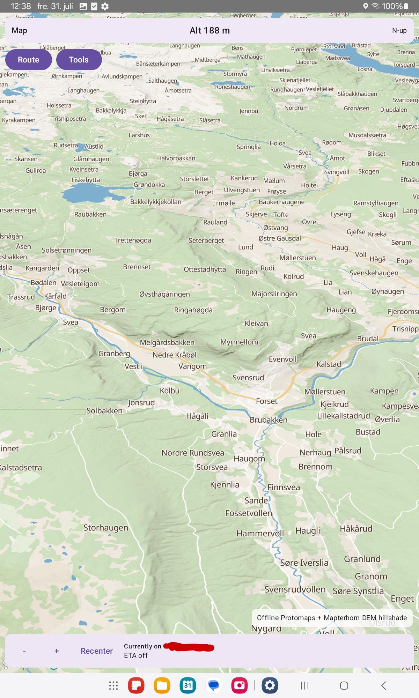

Hiking corridor Skolla → Rondvassbu (**SIMULATING**):

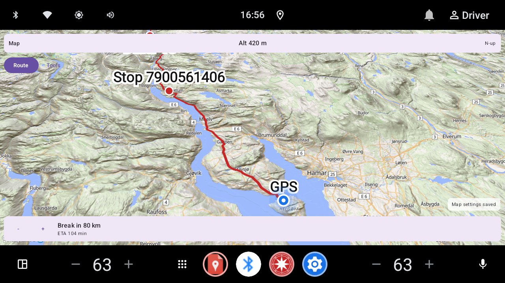

GPS follow during simulation:

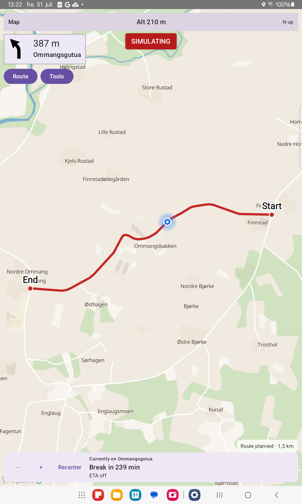

### Real hardware (SM-P613)

Portrait, offline Ostlandet Protomaps, 3D off:

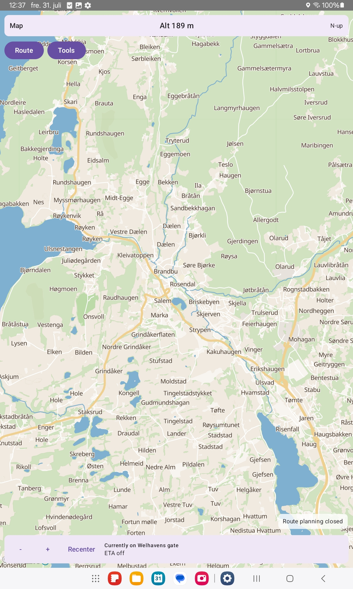

Offline Protomaps military landuse (muted red) and glacier fill, Rena / Gjende:

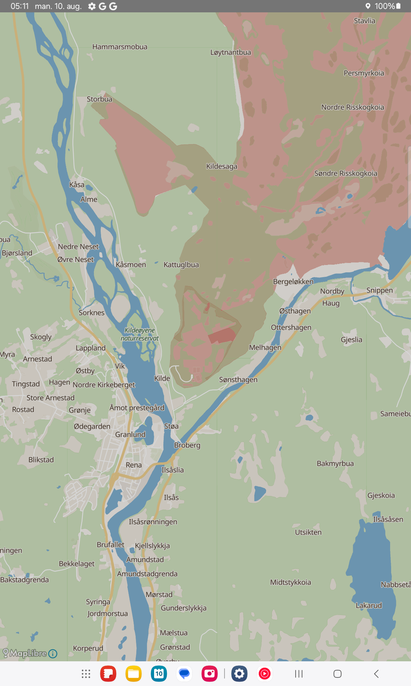

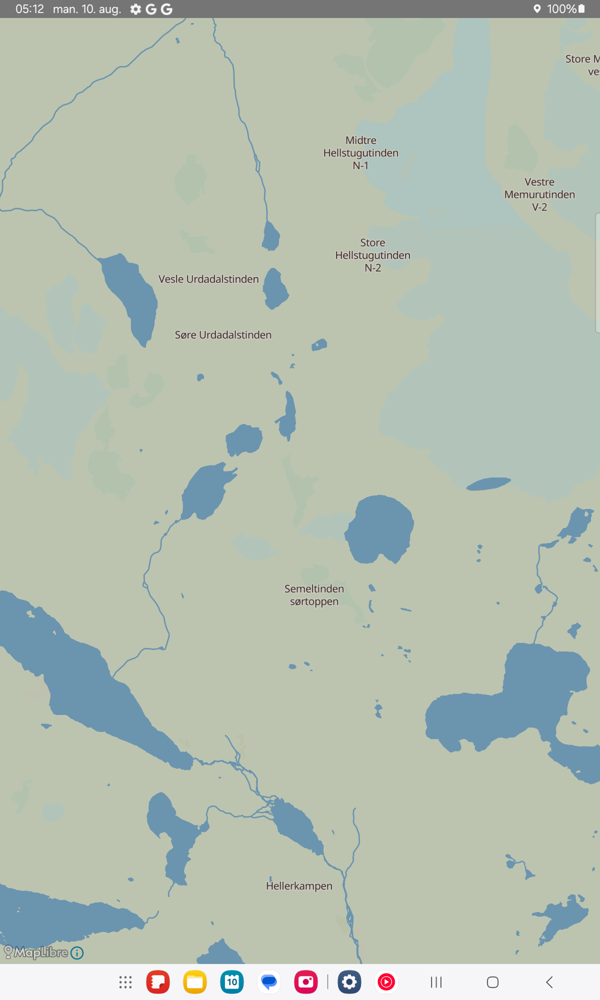

More zoom ladder shots: [`docs/images/military-glacier/`](docs/images/military-glacier/).
Offline Protomaps also labels glacier **names** from ~z12 (`pois.kind=glacier`);
online Liberty still has fill-only ice (upstream OpenMapTiles gap). Details:
[`docs/map-styles.md`](docs/map-styles.md).

Car head-unit testing is still open —
[`docs/real-hardware-testing.md`](docs/real-hardware-testing.md).

### More captures

Idle HUD:

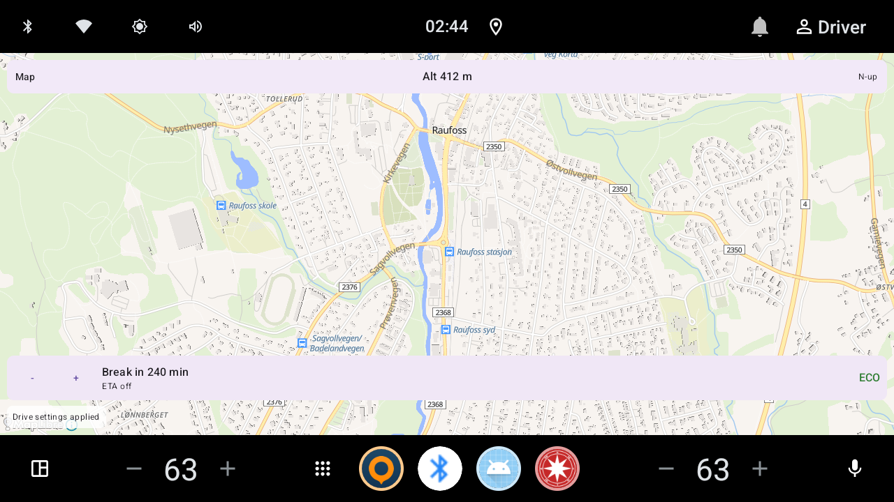

Map tilt 45° (3D off / on):

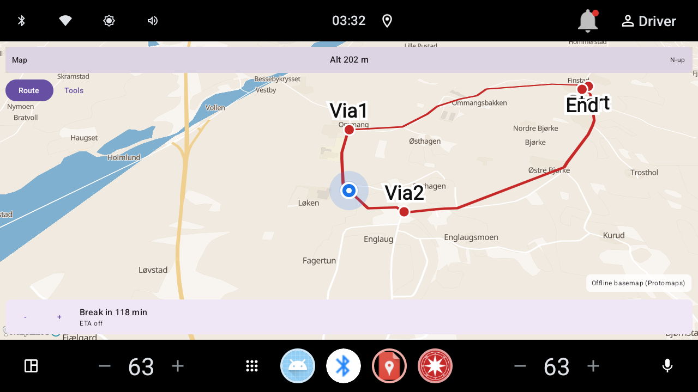

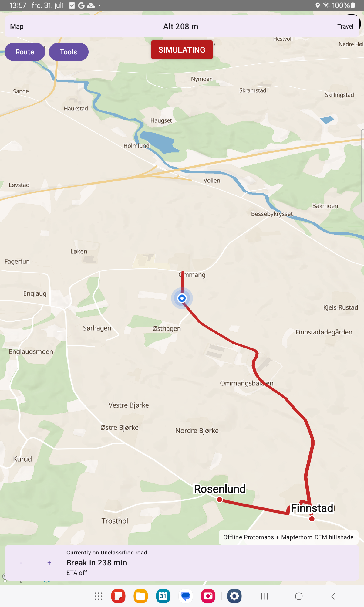

Follow / pan / Recenter / rotation:


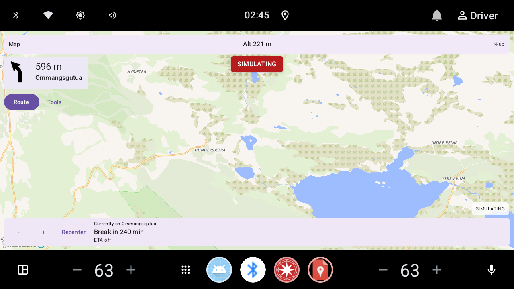

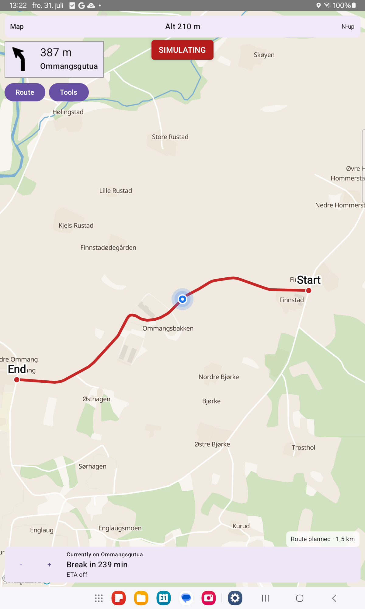

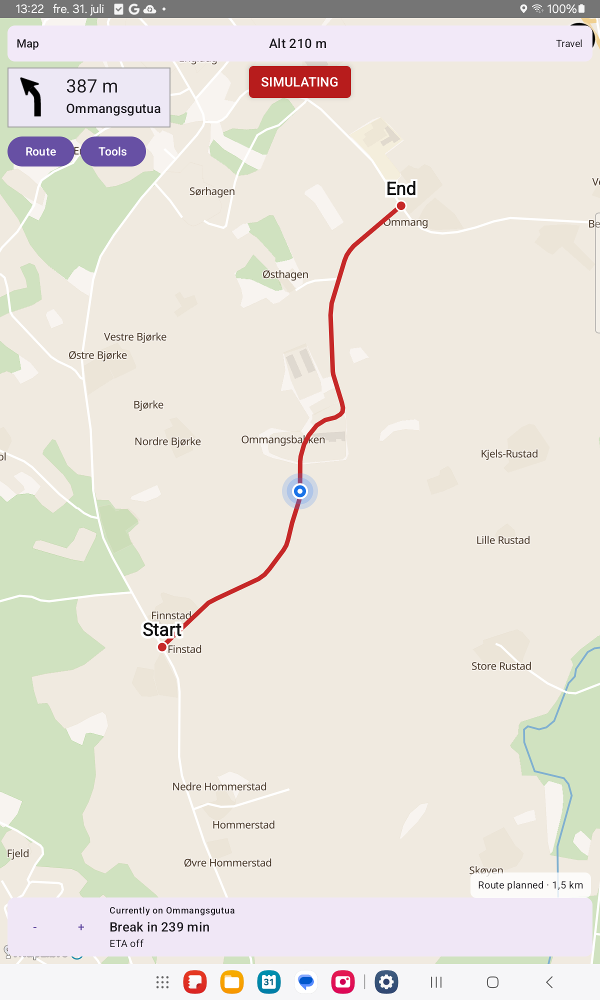

Full gallery: [`docs/pictures.md`](docs/pictures.md) (Norwegian:
[`docs/bilder.md`](docs/bilder.md)).

# Documents

| Document | What it is for |
|---|---|
| [`docs/CONTRIBUTING.md`](docs/CONTRIBUTING.md) | How to contribute |
| [`docs/crates.md`](docs/crates.md) | First-party Rust crates created here, and unaltered crates.io dependencies |
| [`docs/architecture.md`](docs/architecture.md) | How the pieces fit together |
| [`docs/codebase-map.md`](docs/codebase-map.md) | Where to change code for a given feature |
| [`docs/pictures.md`](docs/pictures.md) / [`docs/bilder.md`](docs/bilder.md) | Screenshot galleries |
| [`docs/map-styles.md`](docs/map-styles.md) | Online vs offline map look; 3D |
| [`docs/poi.md`](docs/poi.md) | Place types and search |
| [How to use Navi](docs/how-to-use.md) | End-user how-to (planning, Tools, breaks, saved places/routes, profiles) |
| [`docs/map-marking-saved-places.md`](docs/map-marking-saved-places.md) | Map long-press (4 s) and Saved places detail (Norwegian: [`kartmerking-lagrede-steder.md`](docs/kartmerking-lagrede-steder.md)) |
| [`docs/ec-561-truck-rest.md`](docs/ec-561-truck-rest.md) | EU truck driving-time rules |
| [`docs/fmcsa-truck-rest.md`](docs/fmcsa-truck-rest.md) | US truck hours-of-service |
| [`docs/jurisdiction-rules.md`](docs/jurisdiction-rules.md) | Country/region rule packs |
| [`docs/osm-updates.md`](docs/osm-updates.md) | Opt-in map updates |
| [`docs/android-build.md`](docs/android-build.md) | Build/install Android APK (Linux, macOS, Windows hosts) |
| [`docs/build-linux.md`](docs/build-linux.md) | Linux host: tools, gpsd, adb, Android install |
| [`docs/build-macos.md`](docs/build-macos.md) | macOS host: tools, Android NDK, adb, Android install |
| [`docs/build-windows.md`](docs/build-windows.md) | Windows host: MSVC, tools, Android NDK, adb, Android install |
| [`docs/debugging.md`](docs/debugging.md) | Debugging |
| [`docs/real-hardware-testing.md`](docs/real-hardware-testing.md) | Physical device checklist |
| [`docs/android-test-results.md`](docs/android-test-results.md) | Chronological on-device / emulator instrumented evidence |
| [`docs/status.md`](docs/status.md) | Which docs are live status vs historical evidence |
| [`docs/future-proofing-audit-2026-07.md`](docs/future-proofing-audit-2026-07.md) | Tracked future-proofing / open risk items |
| [`docs/indexed-map-format-plan.md`](docs/indexed-map-format-plan.md) | Phased evaluation of preprocess-once indexed routing maps |
| [`docs/plugins.md`](docs/plugins.md) | Plugin host and roadmap |

See the `docs/` folder for more specialised topics (voice, APRS, ECU, formulas,
and so on).

# Plugins

A sandboxed plugin host exists so future add-ons can run safely. **No product
plugins ship in the app yet** — that is intentional. Overview:
[`docs/plugins.md`](docs/plugins.md).

| Spec | Topic |
|---|---|
| [`docs/plugins/i18n-translation-spec.md`](docs/plugins/i18n-translation-spec.md) | Future UI languages (English-only today). Translator table: [`translations.csv`](docs/plugins/translations.csv) |
| [`docs/plugins/right-to-roam-camping-spec.md`](docs/plugins/right-to-roam-camping-spec.md) | Wild-camping suggestions (plugin, not core) |
| [`docs/plugins/safety-resupply.md`](docs/plugins/safety-resupply.md) | Fuel/water resupply ideas |
| [`docs/plugins/instrument-cluster-agl-spec.md`](docs/plugins/instrument-cluster-agl-spec.md) | Export nav state to instrument clusters |
| [`docs/plugins/animated-icons-spec.md`](docs/plugins/animated-icons-spec.md) | Animated icons |

## Icons (Navit)

POI / turn / status icons under `core/src/icons` are mostly from Navit
(**GPL v2**). Custom maintainer-authored overrides (same mechanism) include
`leaf.svg` (eco) and `speed_camera.svg` (speed-camera warnings) — see
[`docs/icons.md`](docs/icons.md).

# Coding standards and contributing

Please read **[`docs/CONTRIBUTING.md`](docs/CONTRIBUTING.md)**.

Short version of CI expectations:

| Area | Expectation |
|---|---|
| Rust | `cargo fmt`, Clippy with warnings denied, tests |
| Kotlin | ktlint, detekt, unit tests |
| Android | `./gradlew :app:assembleDebug` |

# Building and installing

## Install a prebuilt APK

A debug-signed APK is in [`compiled/navi-debug.apk`](compiled/navi-debug.apk)
(arm64, same package as `./gradlew :app:assembleDebug`). You do not need a
Rust/NDK toolchain to install it.

1. On the device: enable **Developer options** and **USB debugging**.
2. Connect with `adb devices` and confirm the device is listed.
3. If an older Navi build with a **different signature** is already installed,
   uninstall it first (`adb uninstall no.navi.app`).
4. Install and launch:

```bash
adb install -r compiled/navi-debug.apk
adb shell am start -n no.navi.app/.MainActivity
```

This APK is signed with the Android **debug** keystore. It is for testers, not
a Play Store / F-Droid release. To rebuild from source, follow the sections
below.

## Android app (all host platforms)

The product APK is built the same way on **Linux**, **macOS**, and **Windows**:
compile `libnavi.so` with the NDK, then assemble/install with Gradle. Host-specific
setup (SDK paths, NDK clang, `adb`) lives in the OS guides; the shared recipe is
[`docs/android-build.md`](docs/android-build.md).

| Host OS | Install tools, NDK, `adb` | Then follow |
|---|---|---|
| Linux | [`docs/build-linux.md`](docs/build-linux.md) (SDK/`adb` sections + [Android install](docs/build-linux.md#build-and-install-the-android-app)) | [`docs/android-build.md`](docs/android-build.md) |
| macOS | [`docs/build-macos.md`](docs/build-macos.md) | same |
| Windows | [`docs/build-windows.md`](docs/build-windows.md) (use **Git Bash** for `scripts/*.sh`; `.\gradlew.bat` from PowerShell is fine) | same |

**Once per machine:** Rust Android targets, JDK 17, Android SDK (API 36), NDK,
and `ANDROID_HOME` / `ANDROID_NDK_HOME` (see the OS guide). Point
`.cargo/config.toml` linkers at your NDK’s host prebuilt (`linux-x86_64`,
`darwin-arm64` / `darwin-x86_64`, or `windows-x86_64`).

### Emulator (x86_64 image)

```bash
# From the repo root (bash: Linux/macOS Terminal, or Git Bash on Windows)
export ANDROID_HOME=…                 # see OS guide for typical path
export ANDROID_NDK_HOME="$ANDROID_HOME/ndk/<version>"
rustup target add x86_64-linux-android   # once
./scripts/build-android-native.sh x86_64-linux-android release
./gradlew :app:assembleDebug          # Windows PowerShell: .\gradlew.bat …
./gradlew :app:installDebug
./scripts/launch-navi-emulator.sh
```

### Tablet / phone (arm64)

```bash
export ANDROID_HOME=…
export ANDROID_NDK_HOME="$ANDROID_HOME/ndk/<version>"
rustup target add aarch64-linux-android   # once
./scripts/build-android-native.sh aarch64-linux-android release
./gradlew :app:assembleDebug
./gradlew :app:installDebug
# Equivalent:
#   adb install -r app/build/outputs/apk/debug/app-debug.apk
adb shell am start -n no.navi.app/.MainActivity
```

Confirm the APK contains the arm64 library:

```bash
unzip -l app/build/outputs/apk/debug/app-debug.apk | grep 'lib/arm64-v8a/libnavi.so'
```

On Windows PowerShell you can use Gradle install (`.\gradlew.bat :app:installDebug`)
or `adb install -r app\build\outputs\apk\debug\app-debug.apk`.

### Release build (APK / AAB)

Debug installs use the Android **debug** keystore. A **release** package is what
you sideload as release, hand to F-Droid-style checks, or smoke-test as an AAB.

1. **Native library** for every ABI you ship (store AABs usually need both):

```bash
export ANDROID_HOME=…
export ANDROID_NDK_HOME="$ANDROID_HOME/ndk/<version>"
./scripts/build-android-native.sh aarch64-linux-android release
./scripts/build-android-native.sh x86_64-linux-android release
```

2. **Local upload keystore** (optional but recommended for installable release
   APKs / AAB smoke). Creates gitignored `app/keystore/navi-upload.jks` — for
   **local testing only**, not Play production signing:

```bash
./scripts/make-upload-keystore.sh
```

   If that file exists, the `release` build type signs with it. Override
   passwords/alias with Gradle properties `navi.upload.storePassword`,
   `navi.upload.keyAlias`, and `navi.upload.keyPassword` if needed. Without a
   keystore, Gradle still produces release outputs, but they may be unsigned.

3. **Assemble**:

```bash
# Signed/unsigned release APK
./gradlew :app:assembleRelease
# → app/build/outputs/apk/release/app-release.apk

# Play-style app bundle
./gradlew :app:bundleRelease
# → app/build/outputs/bundle/release/app-release.aab
```

4. **Install a release APK** (signatures differ from debug — uninstall the debug
   build first if `adb` refuses the upgrade):

```bash
adb uninstall no.navi.app   # only if a debug/other-signed build is present
adb install -r app/build/outputs/apk/release/app-release.apk
adb shell am start -n no.navi.app/.MainActivity
```

5. **AAB smoke** (optional): validate / split / install with
   [bundletool](https://github.com/google/bundletool) as in
   [`docs/android-api36-plan.md`](docs/android-api36-plan.md#aab-smoke-host).

Current `versionName` / `versionCode` live in `app/build.gradle.kts`
(`0.2.0` / `2` at time of writing). Bump those before a real store or tagged
release. F-Droid-style Podman reproducibility:
[`tools/fdroid-check/README.md`](tools/fdroid-check/README.md). Full shared
recipe: [`docs/android-build.md`](docs/android-build.md).

## Desktop / core (optional)

| Host | Guide |
|---|---|
| Linux (`navi-desktop`, gpsd, core tests) | [`docs/build-linux.md`](docs/build-linux.md) |
| macOS (tools + optional desktop shell) | [`docs/build-macos.md`](docs/build-macos.md) |
| Windows (MSVC, tools + optional desktop shell) | [`docs/build-windows.md`](docs/build-windows.md) |

### Workspace layout

- `core/` — routing, places, rest rules, icons (Rust)
- `navi-ffi/` — bridge to Android and other hosts
- `app/` — Android UI (Kotlin)
- `plugin-host/` / `plugin-sdk/` / `plugins/` — future plugins
- [`docs/architecture.md`](docs/architecture.md) — how it fits together

### Host tests (examples)

```bash
cargo test -p driver-break-core --test planner_options_routes
cargo test -p navi-plugin-host --test isolation -- --nocapture
```

Large map-file integration tests are usually marked `#[ignore]` and need
fixtures under `core/target/integration-fixtures`. See
[`docs/test-results.md`](docs/test-results.md).

# Where the map data comes from

Navi is **offline-first**. The network is used only when you choose to download
or update.

| Data | Source | Used for |
|---|---|---|
| Roads & places | OpenStreetMap via Geofabrik `.osm.pbf` | Routing and search |
| Map updates | Geofabrik diffs / fresh extract | Opt-in refresh only |
| Elevation | Public DEM tiles | Eco / hills |
| Map picture | OpenFreeMap Liberty (online) or Protomaps PMTiles (offline) | What you see on screen |
| Position | Device GPS (or gpsd on Linux) | Where you are |
| Icons | Mostly Navit-derived SVG; custom `leaf` / `speed_camera` | Markers and turns |

Country/region visual extracts can also be prepared with
[PMT-splitter](https://github.com/Supermagnum/PMT-splitter/tree/main).

# Known issues

- **Plugins:** content add-ons are intentionally not shipped yet, as they have
  not been made.
- **UI polish:** the screens work but still need visual tidy-up on car displays.
- **Moving icons:** drawn with a Compose overlay today; native map symbol layers
  are not the primary path yet.
- **Map / GPU quirks:** some emulator and phone GPU setups have historically
  crashed or washed out hillshade; the project defaulted to MapLibre GLES after
  SM-P613 and Pixel 9a checks. Details in [`docs/map-styles.md`](docs/map-styles.md)
  and [`docs/debugging.md`](docs/debugging.md).
- **Screenshot-only lake fringe:** a soft blue rim around water can appear in
  captures but not while using the app live — see
  [`docs/map-styles.md`](docs/map-styles.md).
- **Region-scale pack conversion has thin memory margin on lower-end 4GB-class
  hardware.** Measured on a Samsung Galaxy Tab S6 Lite (SM-P613, ~3.5GB total
  RAM — below this project's nominal 4GB floor): a full Østlandet-scale
  background conversion completed successfully with no crash and no process
  kill, but system-level available memory dropped to ~329 MiB at its lowest
  point, ~250 MiB of swap was used, and Android issued
  `TRIM_MEMORY_RUNNING_CRITICAL` to other running processes during the
  conversion's POI phase. This indicates real, if survived, system memory
  pressure — not a comfortable margin. Devices with less RAM than this
  reference device, or under heavier concurrent load (more background apps,
  less free memory at the time conversion starts), remain an open risk. Region
  download and immediate use are unaffected (bbox/PBF fallback works
  immediately regardless); this risk is specific to the background
  pack-conversion step. Further mitigation (e.g. smaller tile size, trading
  more wall-clock time for wider memory margin) has not yet been implemented.
  Cross-ref: [`docs/indexed-map-format-plan.md`](docs/indexed-map-format-plan.md)
  and [Minimum hardware and storage](#minimum-hardware-and-storage).
- **Cold / missing-pack planning is still data-loading-bound; pack-hit is not.**
  A* itself is typically sub-second. **With indexed packs ready** (Phase 4 + 4b;
  see [`docs/indexed-map-format-plan.md`](docs/indexed-map-format-plan.md)):
  motor pack-hit ~1.5–1.8 s vs cold missing-pack ~31 s on Hedmark 162 km;
  wetland load **18.6 s → 93 ms** (~199×) on SM-P613; long Hiking OD that
  previously aborted ~6 min completes (~61 s) with `wetland_pack_hit`.
  Historical pre-pack Car Espa→Atnbrufossen (SM-P613): `plan_duration_ms=26835`
  with `graph_build_ms=17571`, `poi_barrier_ms=8045`, `astar_ms=378` — that
  ~15–27 s class remains the **fallback** when packs are missing, stale, or
  still converting in the background. `.navigph` deprecated. Region-scale packs
  now include tiled wetland + overnight buildings (POI/barrier v2): short
  Atnbrufossen hike on SM-P613 **159 s → ~3.1 s** with `wetland_pack_hit` and
  `overnight_buildings_pack_hit`. Reproduce stages with Diagnostic logging →
  `ROUTE_PLAN` / `ROUTE_PLAN_STAGES`
  ([`docs/debugging.md`](docs/debugging.md#3b-diagnostic-session-log-on-device-file)).
  See also [`docs/status.md`](docs/status.md).
- **Rerouting after a detour is not instant.** Off-route (cross-track beyond
  ~75 m motor / ~100 m hiking) reuses the same planner: **pack-hit when packs
  are ready** (~seconds class matching Plan), otherwise the slower PBF
  fallback. While off-route, the approach box shows **Off route**. A
  **Recalculating route…** banner is shown during the wait (with Cancel). This
  is an expected wait, not a hang. Motor profiles auto-reroute after a short
  sustained debounce (~5 s); **Hiking prompts** first. See
  [`docs/route-simulation.md`](docs/route-simulation.md#guidance).
- **Hiking plan speed on huge areas (addressed for packs):** overnight buildings
  use a 1.5 km corridor pre-filter over pack-stored centroids when POI/barrier
  v2 packs are ready (exact 150 m allemannsretten check unchanged). Historical
  DNT Åkersætra→Rondvassbu
  (~**139.9 km** corridor; `overnight_scan_bench`, debug): bbox-all
  **102 556 buildings / ~180.7 s** load → corridor **487 buildings / ~83.1 s**
  load. Graph/wetland/overnight pack-hit removes that PBF path when packs are
  ready (fallback remains if packs are missing or still converting).
- **Break timer ≠ trip ETA:** by design — see
  [Break timer vs trip ETA](#break-timer-vs-trip-eta).
- **Overnight glacier safety vs basemap can disagree.** Hiking overnight
  exclusion (`SAFETY_MIN_GLACIER_DISTANCE_M`, 1 km to glacier **polygon edge**)
  reads Geofabrik `.osm.pbf` / the `.navi-poi-barrier` pack. Offline map ice fill
  and glacier **name** labels come from a separately downloaded Protomaps
  PMTiles extract. Those pipelines update independently (different Tools actions
  and build dates). Confirmed on SM-P613 Ostlandet: PBF mtime vs PMTiles content
  date differed, and at Gjende (OSM way `380644665`) pack geometry and basemap
  `landuse.kind=glacier` tiles did not cover the same footprint. A tent site may
  therefore be excluded near ice the map does not show (or vice versa). The plan
  UI surfaces the reason explicitly (e.g. `Excluded: within 1 km of a glacier`)
  so the decision stays legible when map and pack disagree. Future consideration
  (not built): optional “refresh basemap after OSM update” prompt. See
  [`docs/poi.md`](docs/poi.md) and [`docs/map-styles.md`](docs/map-styles.md).
- **Online Liberty has no named glacier labels.** OpenFreeMap Liberty /
  OpenMapTiles expose ice as fill only (`landcover_ice`); there is no glacier
  POI name path to style. Offline Protomaps labels `pois.kind=glacier` from
  ~z12. Not a Navi Liberty regression — see [`docs/map-styles.md`](docs/map-styles.md).
- **Pilgrim stamp / credential offices have no stable OSM tag.** Official
  pilgrim centers (pilegrimspass / credencial stamp points) are tagged
  inconsistently: `tourism=information`+`information=office`, bare
  `building=office`, guideposts, or (Camino) `office=company`. Navi therefore
  has **no dedicated POI category** for them — a name matcher would mostly hit
  guideposts, and `information=office` would pull generic tourist offices.
  Pilgrim lodgings (`tourism=hostel` / `guest_house`) already match Lodging /
  Cabin. Named centers remain searchable via the place index when present.
  Upstream proposal under discussion:
  [proposal: pilgrimage=stamp_office and network=pilgrim](https://community.openstreetmap.org/t/proposal-pilgrimage-stamp-office-and-network-pilgrim/146371).
  Related `tourism=checkpoint` / `checkpoint:type=stamp` tagging does not close
  the gap (no reliable route-relation link, tourism-key collision, no
  pilgrimage semantics). Revisit a `PilgrimCenter` category if OSM settles on a
  consistent, machine-readable scheme. See [`docs/poi.md`](docs/poi.md) and
  [`docs/how-to-use.md`](docs/how-to-use.md#pilgrim-stops-and-stamp-centers-poi-coverage).
- **Not implemented yet:** checking whether the code can be optimised for
  rendering.

# TODO

(Future work only — shipped features are listed in the Features table above.)
