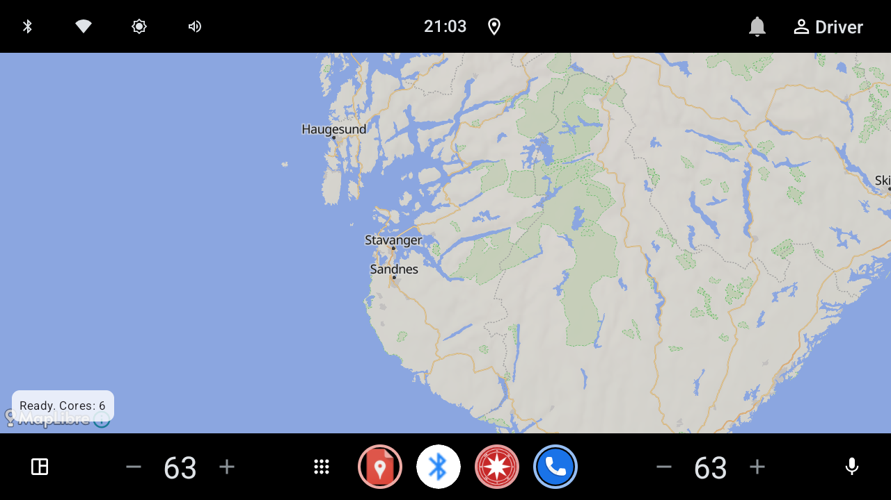
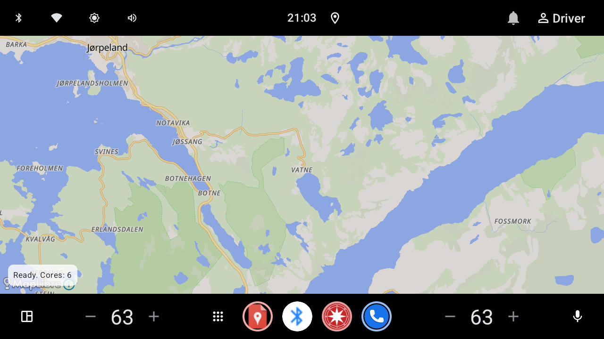

# AI assistance

This project was developed with AI assistance (Claude). The author has a
neurological condition related to dyscalculia that affects programming in a way
analogous to how dyscalculia affects mathematical ability — AI assistance was
used to help translate design intent into working code and documentation. Design
decisions, requirements, and testing were directed and reviewed by the author
throughout.

# Navi

Offline navigation core and Android host for route planning with terrain-aware
(eco) costing, POI awareness, rest/overnight planning, and profile-based routing.

License of this repository: see `LICENSE` (GPL-3.0-or-later unless otherwise noted).

## Working app (emulator screenshots)

Captured on Android Automotive emulator with MapLibre + OpenFreeMap liberty
basemap. Street-level shot shows standard map POI icons; corridor shot shows a
computed route overlay.

| Zoom / scene | Preview |
|---|---|
| Regional (z6.5) at 58.991547, 6.138377 |  |
| Town (z11) |  |
| Street (z16) — basemap POIs visible |  |
| Corridor route Espa → Atnbrufossen |  |

More detail: [`android-test-results.md`](android-test-results.md).

## Documents

| Document | Description |
|---|---|
| [`architecture.md`](architecture.md) | Crate layout, thread tiers, network principle, plugins |
| [`docs/poi.md`](docs/poi.md) | Searchable POI categories and OSM tag rules |
| [`docs/osm-updates.md`](docs/osm-updates.md) | Opt-in Geofabrik check / `.osc.gz` / full re-download |
| [`docs/plugins.md`](docs/plugins.md) | WASM plugin host, HostApi, manifest, isolation |
| [`docs/icons.md`](docs/icons.md) | Icon inventory, resolution order, Navit GPL-v2 flag |
| [`docs/API.md`](docs/API.md) | UniFFI / host API overview |
| [`docs/PROTOCOLS.md`](docs/PROTOCOLS.md) | External wire protocols (placeholder) |
| [`docs/APRS.md`](docs/APRS.md) | APRS (not yet implemented) |
| [`docs/CAT.md`](docs/CAT.md) | CAT radio control (not yet implemented) |
| [`test-results.md`](test-results.md) | Host integration test notes |
| [`android-test-results.md`](android-test-results.md) | On-device / emulator results |

## Icons (Navit)

See [`docs/icons.md`](docs/icons.md) for the full icon system notes. Summary:
POI/maneuver/status icons under `core/src/icons` are Navit-derived (**GPL v2**).
Resolution prefers user overrides, then the bundled set, then `unknown.svg`.

## Performance constraints (target: 8-core ~2 GHz, 4 GB RAM)

Planning targets (not yet measured on the target device). Reference: a Rust
OSM-graph project parsing ~9M nodes / ~18M edges in ~30 s / &lt;5 GB on an 8-core
desktop, scaled down for lower clocks and a 4 GB budget.

| Task | Data scale | Estimated time | Notes |
|---|---|---|---|
| OSM `.pbf` parse + graph build | ~1.5M nodes / ~1.26M edges | ~30–90 s | Mostly single-pass CPU + I/O |
| POI R-tree build | Low thousands of POIs | &lt; 1 s | Near-linear bulk load |
| Eco-reweighting (elevation) | ~1.26M edges, ~9 DEM tiles | ~10–60 s, once per region | Cache decompressed tiles; do not re-read per edge |
| A* single route | ~1.26M edges | &lt; 1 s (often 100–300 ms) | |
| Multi-day + hut matching | Regional graph | 1–3 s | On an already-loaded graph |

### Hard constraint: RAM

- **4 GB is the binding limit**, not CPU frequency.
- Default working set: **county/regional extracts** (~1.5M nodes).
- Country-scale extracts for large countries risk OOM on 4 GB — treat as
  opt-in with an in-app warning ("may be slow or fail on low-RAM devices").
- The 9M-node reference already needed under 5 GB on desktop; that scale is not
  a safe in-memory default on this class of device.

### Required mitigations

1. Cap default load scope at regional extracts; country-scale is opt-in + warning.
2. Persist the reweighted graph after eco-reweight (SQLite or flat binary) — do
   not recompute on every launch.
3. Stream/tile DEM lookups via an LRU tile cache; do not keep every tile fully
   decompressed at once beyond what the warm cache needs.
4. Run graph parse/build on a background (routing-tier) thread with progress UI.

Worker pools must use `std::thread::available_parallelism()` (or equivalent) and
leave headroom for audio/UI (do not saturate every detected core). Routing-tier
work runs at lower OS priority than audio/UI.

## Workspace layout

- `core/` — Rust library (`driver-break-core`): elevation, routing, POI, rest/safety, search, icons.
- `navi-ffi/` — UniFFI CDYLIB for Android and other hosts.
- `app/` — Android host (Kotlin/Compose) linking the core via UniFFI.
- `plugin-host/` / `plugin-sdk/` / `plugins/` — sandboxed WASM plugins.
- `test-results.md` / `android-test-results.md` — integration reports.

## Host tests

```bash
cargo test --test kongsvinger_lillehammer_integration -- --nocapture --ignored
cargo test --test dnt_hiking_integration -- --nocapture --ignored
cargo test -p navi-plugin-host --test isolation -- --nocapture
cargo test -p driver-break-core poi::
cargo test -p driver-break-core osm_update::
```
