# Bilder

**[English pictures gallery](pictures.md)** · **[Norsk README](../Norwegian.md)**

Skjermbilder for Navi. **Bare ekte maskinvare** (Samsung Galaxy Tab S6 Lite
SM-P613). Ikke bruk emulator for galleriopptak.

Rute-/posisjonsscener bruker innbakt **rutesimulator** (rød **SIMULATING**-fane)
langs en **ekte planleggingskjøring**. Galleri­rammer skal **ikke** avsløre
testerens live GPS-posisjon.

Koordinater ble tastet inn i Rute-søkefeltet som `lat, lon`. Topp-/POI-rammer
som skal vise grunnkart-ikoner ved zoom ≥ **16** kan også bruke
`pendingCamera` / `GalleryPeakPoiRetakeScreenshotTest`.

Grunnkart-ameniteter/topper (ikke [`poi.md`](poi.md) PoiIndex) krever zoom ≥
**16**. Liberty mangler `mountain_peak`; noen topper (f.eks. Elgpiggen) synes
på frakoblet Protomaps men ikke online Liberty.

## GitHub-tillatelsesliste (plass)

**Bare** filene listet nedenfor kan committes under `docs/images/`.
Ekstra instrumenterte testopptak blir på enheten / lokal disk.

Bruk **ikke** syntetiske (håndtegnede / 2-punkts stubb) ruter.

Idle HUD og Skolla → Rondvassbu-oversikt også i
[Norwegian README](../Norwegian.md) / [engelsk README](../README.md)
(`docs/images/hud/hud_idle_both_bars.png`,
`docs/images/terrain/hike_eldabu_ramshogda_3d.png`).
Kaldstart-splash (rødt open-app-merke): `docs/images/splash_open_app.png`.
45° tilt (Løten-løkke): `tilt45_3d_off.png`, `tilt45_3d_on.png`.
GPS follow / Recenter (alle med **SIMULATING**): `follow_gps/01` … `06`.
Nåværende gate UTF-8:
`hud_current_street_mjosevegen.png` (ø), `hud_current_street_trollaas.png` (å),
`hud_current_street_aevongsli.png` (Æ).

Opptakssele: `GalleryDocsKeyboardCaptureTest` (SM-P613). Hent:
`adb pull /data/local/tmp/navi_gallery_docs/ docs/images/`.

POI online/frakoblet-par under `docs/images/`:
`poi_jutulhogget.png` / `poi_jutulhogget_offline.png`,
`poi_galdhopiggen_3d.png` / `poi_galdhopiggen_online.png`,
`poi_elgpiggen.png` / `poi_elgpiggen_online.png`,
`poi_prekestolen.png` / `poi_prekestolen_offline.png`.

## Kart / ruting (dokumenterte korridorer)

Ruteoverlegg tatt på **SM-P613** med **SIMULATING** der posisjonsmarkør vises.
Ruteplanlegger-chrome er lukket for karttunge bilder (Løten-løkke, Espa,
fot / elsykkel) slik at korridoren synes.

| Scene | Forhåndsvisning |
|---|---|
| Espa → Atnbrufossen (øko / hovedkorridor), SIMULATING | 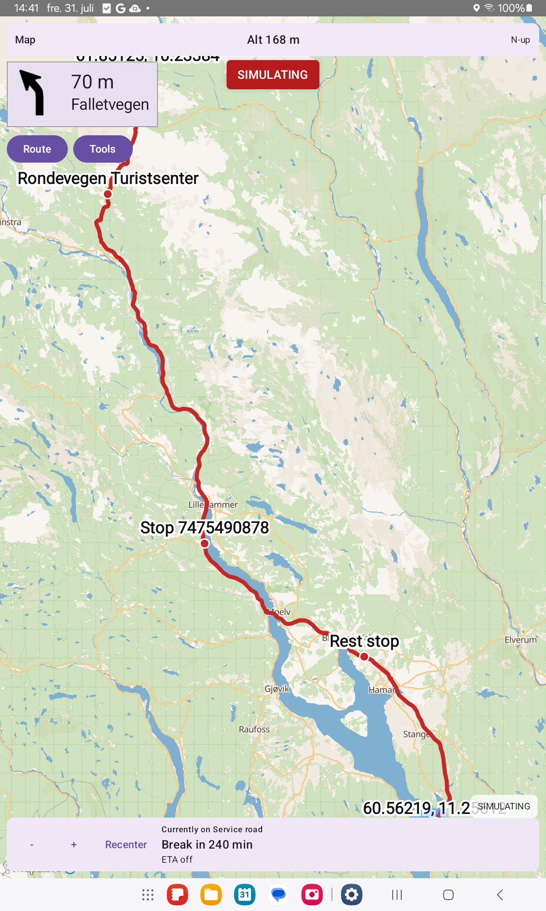 |
| Åkersætra → Jammerdalsbu → Rondvassbu (DNT-fot), SIMULATING | 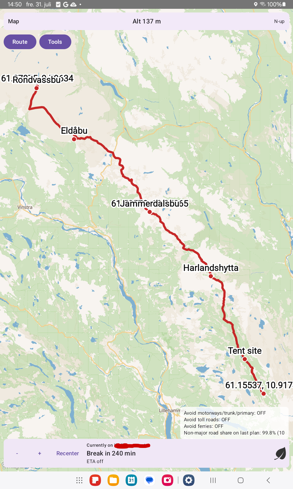 |
| Ringebu / Venabygdsfjellet (elsykkel-stigning), SIMULATING | 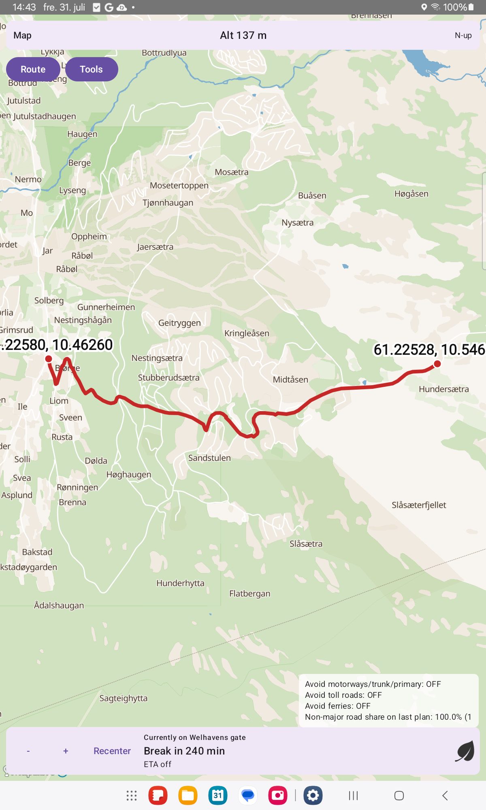 |
| Ådalsbruk / Løten-løkke (simulator + svinginstruks), SIMULATING | 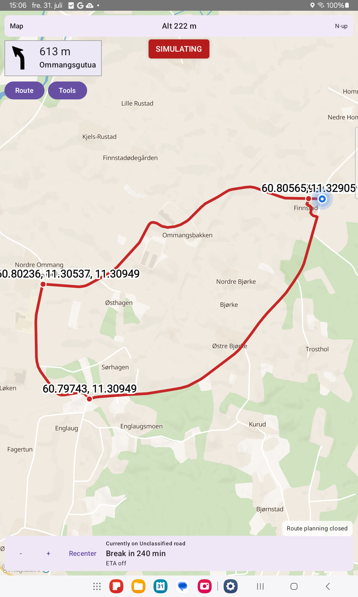 |
| Samme Løten-løkke (eldre `route_map.png`-plass) |  |
| Finnstad → Søndre Ommang → Rosenlund, 3D på, SIMULATING | 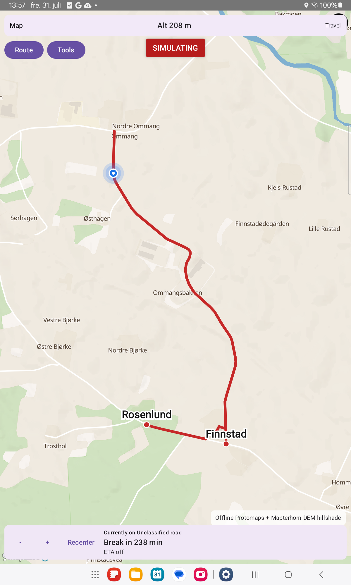 |
| Finnstad → Søndre Ommang → Rosenlund, flatt, SIMULATING | 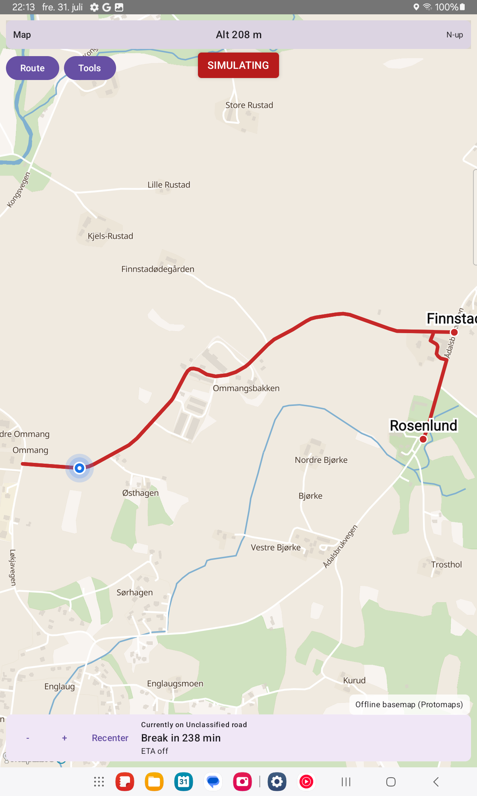 |
| 45° tilt, 3D av, SIMULATING (Løten) |  |
| 45° tilt, 3D på, SIMULATING (Løten) |  |

## Enkeltpunkter (tastatur fly-til)

Statiske kartrammer etter at WGS84-koordinater er tastet inn i Rute-søk
(ingen live GPS-følg; Rute-chrome lukket før screencap). Opt-in 3D med **45°**
kameratilt og Mapterhorn-hillshade der det finnes.

Hvert landemerke har **online** (Liberty + fjern-DEM) og **frakoblet**
(Ostlandet Protomaps PMTiles + lokal DEM) når punktet ligger inne i installert
extract. Preikestolen ligger utenfor Ostlandet-dekning: frakoblet preferanse
faller tilbake til Liberty 3D (dokumentert fallback-rad).

| Scene | Forhåndsvisning |
|---|---|
| Jutulhogget canyon, online 3D | 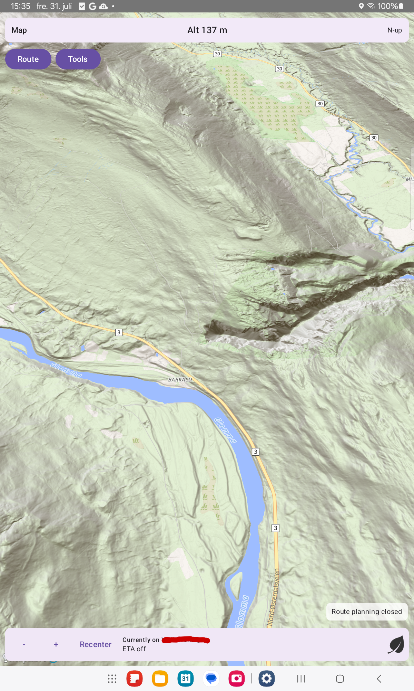 |
| Jutulhogget canyon, frakoblet Protomaps 3D | 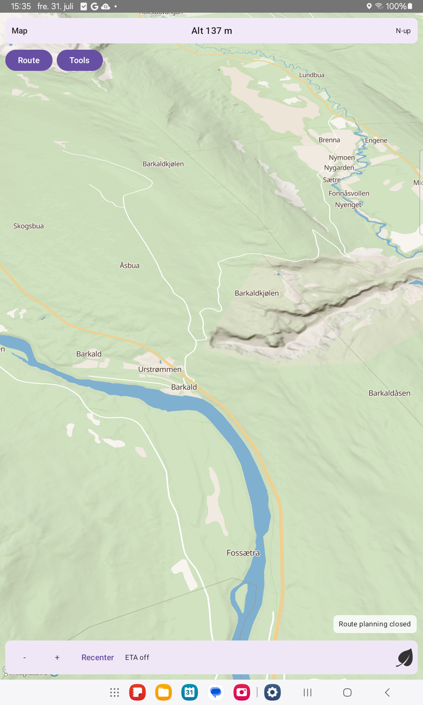 |
| Galdhøpiggen, frakoblet Protomaps 3D | 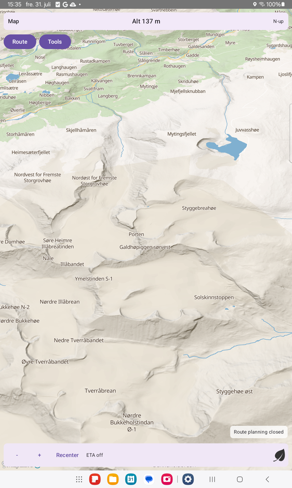 |
| Galdhøpiggen, online 3D | 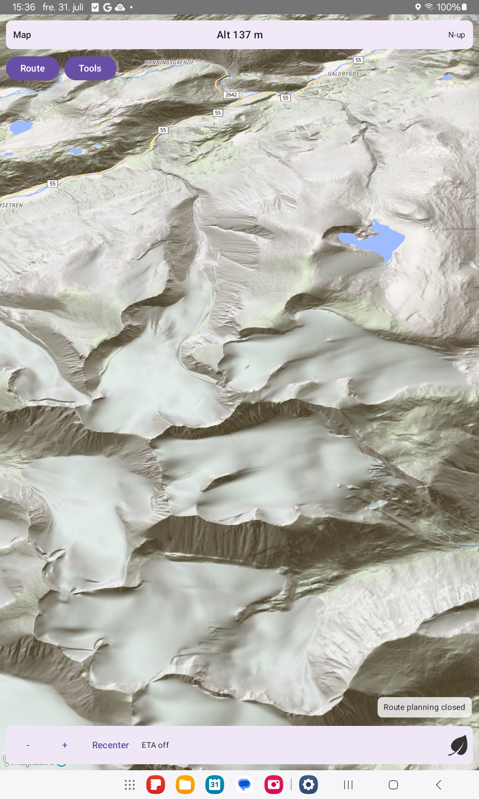 |
| Elgpiggen, frakoblet Protomaps 3D | 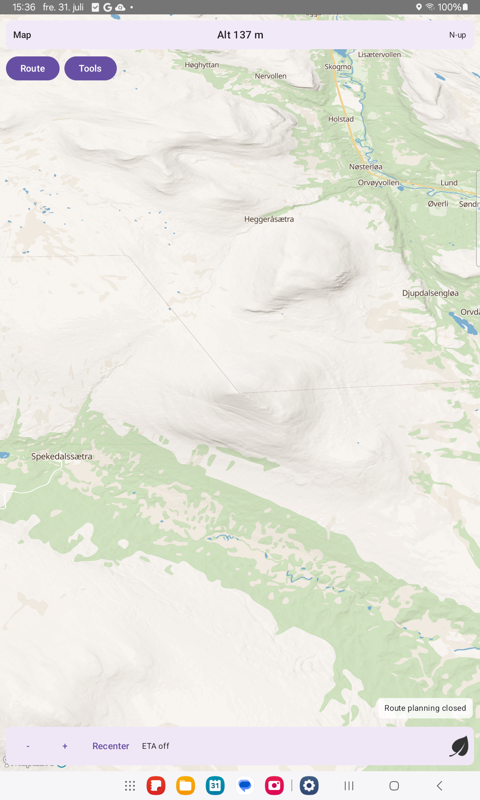 |
| Elgpiggen, online Liberty 3D (topp ofte mangler i OMT; DEM-ramme) | 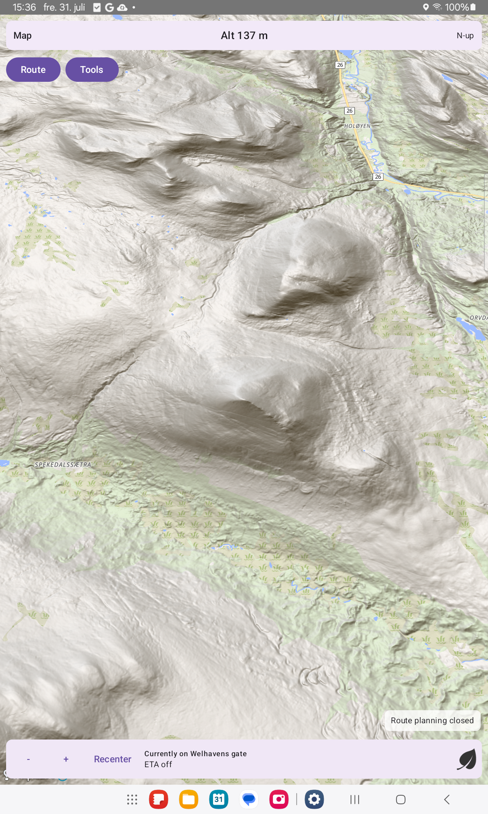 |
| Preikestolen, online 3D | 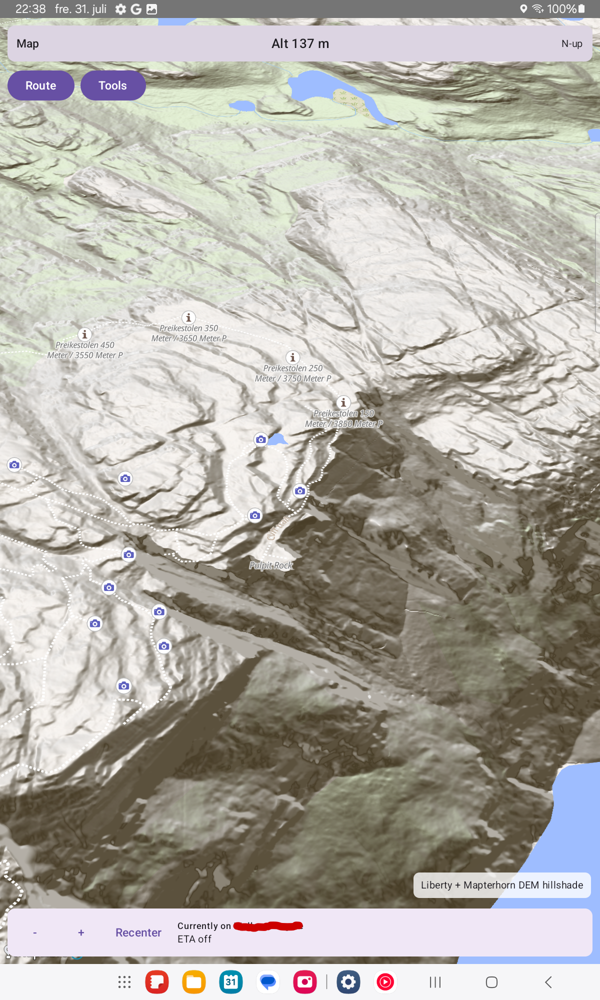 |
| Preikestolen med frakoblet preferanse (ingen Ostlandet-PMTiles → Liberty 3D-fallback) | 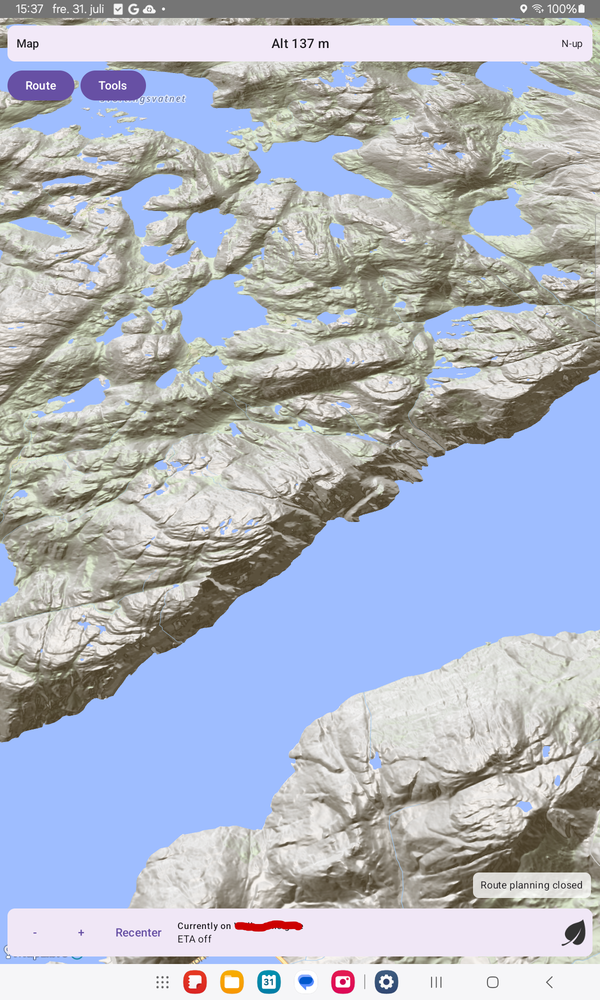 |

## Nåværende gate (bunn-HUD)

| Scene | Forhåndsvisning |
|---|---|
| Currently on Mjøsvegen (ø) |  |
| Currently on Trollåsveien (å) |  |
| Currently on Ævongsli (Æ) |  |

## Bevegelige ikoner (APRS-stil)

| Scene | Forhåndsvisning |
|---|---|
| Før flytting |  |
| Etter flytting |  |
| Etter flytting (2) |  |

## GPS follow / Recenter / rotasjon

Alle med **SIMULATING** på Løten-løkka (ikke live GPS).

| Scene | Forhåndsvisning |
|---|---|
| Simulering med GPS-følg |  |
| Etter pan |  |
| Etter Recenter |  |
| Rotasjonsmoduser OK |  |

## Frakoblet PMTiles-grunnkart / 3D

| Scene | Forhåndsvisning |
|---|---|
| Frakoblet Protomaps (Kløfta, 3D av) |  |
| Dekningsgrense → live Liberty (Tromsø) |  |
| Online 3D (Mapterhorn DEM hillshade, Gjendebu) |  |
| Flatt kart, Gjendebu |  |

## Flerdagers dagkort

Oppdatert på **SM-P613**. Fot-kort fra tastaturplan Åkersætra → Jammerdalsbu →
Rondvassbu (`GalleryDocsKeyboardCaptureTest`). Lastebil-kort fra tastaturplan
Espa → Atnbrufossen med stram daglig kjøretid slik at planleggeren emitterer
ekte `daysJson`-kort (ikke live-GPS Bodø — personvern).

| Scene | Forhåndsvisning |
|---|---|
| Lastebil flerdagers dagkort (Espa → Atnbrufossen, ferdig plan) | 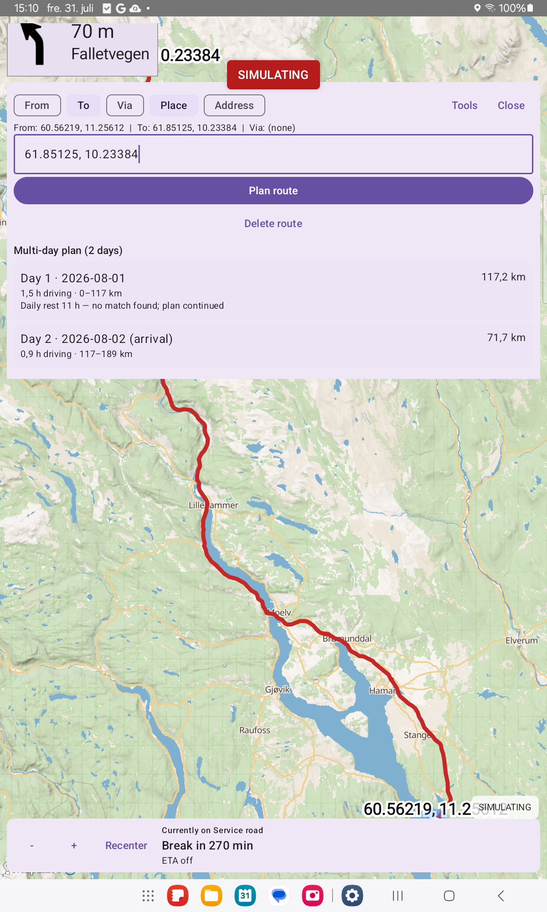 |
| Fot flerdagers dagkort (Åkersætra → Rondvassbu) | 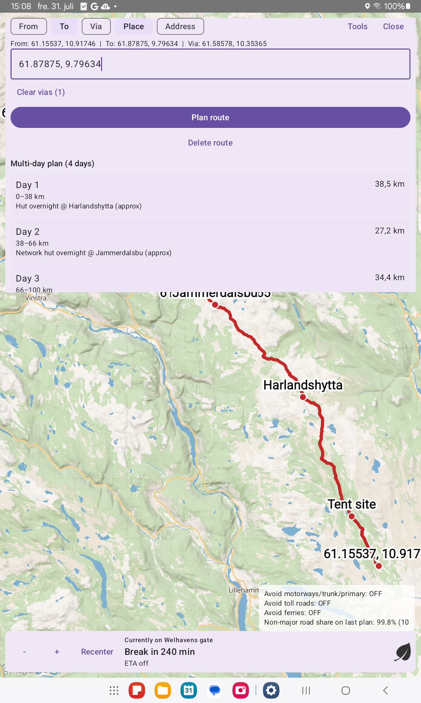 |
