# Bilder

**[English pictures gallery](pictures.md)** · **[Norsk README](../Norwegian.md)**

Emulatorskjermbilder for Navi (MapLibre + OpenFreeMap liberty på Android
Automotive).

## GitHub-tillatelsesliste (plass)

**Bare** filene listet nedenfor kan committes under `docs/images/`.
Ekstra instrumenterte testopptak blir på enheten / lokal disk og skal ikke
legges til i depotet.

Bruk **ikke** syntetiske (håndtegnede / 2-punkts stubb) ruter i tester eller i
skjermbilder som dokumenterer ruting — korridorgeometri må komme fra en ekte
planleggingskjøring (vert `raufoss_approach_route`, in-app korridorpipeline,
osv.).

Idle HUD-linjer og Helgøya → Atnbrua-ruteopptaket ligger bare i
[Norwegian README](../Norwegian.md#fungerende-app-emulatorskjermbilder) /
[engelsk README](../README.md#working-app-emulator-screenshots)
(`docs/images/hud/hud_idle_both_bars.png`,
`docs/images/terrain/hike_eldabu_ramshogda_3d.png`).
Karttilt ved 45° (3D av / 3D på) vises også der
(`docs/images/tilt45_3d_off.png`, `docs/images/tilt45_3d_on.png`).
Nåværende gate UTF-8-bevis:
`docs/images/hud/hud_current_street_mjosevegen.png` (ø),
`hud_current_street_trollaas.png` (å),
`hud_current_street_aevongsli.png` (Æ).

## Kart / ruting

| Scene | Forhåndsvisning |
|---|---|
| Prekestolen basecamp, POI synlige. | 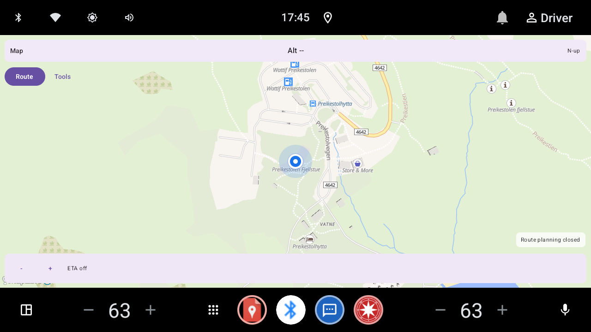 |
| Helgøya → Atnbrua (øko + 3D på, pauser synlige) | 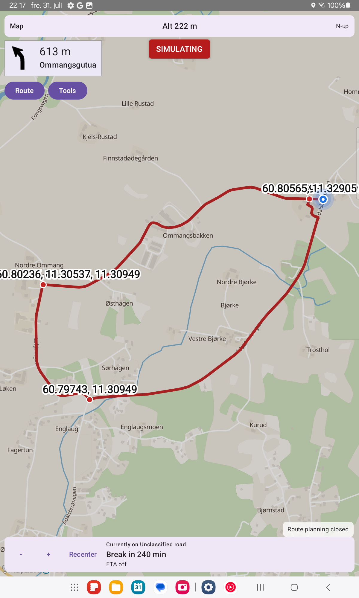 |
| Rute fra Gjendebu til Thonvollen, 3D-kart. | 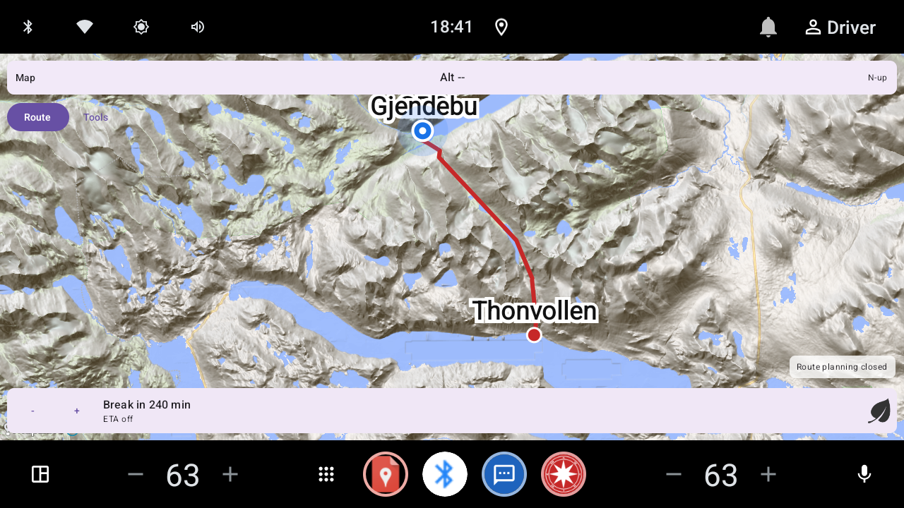 |
| Gjendebu til Thonvollen, flatt kart. | 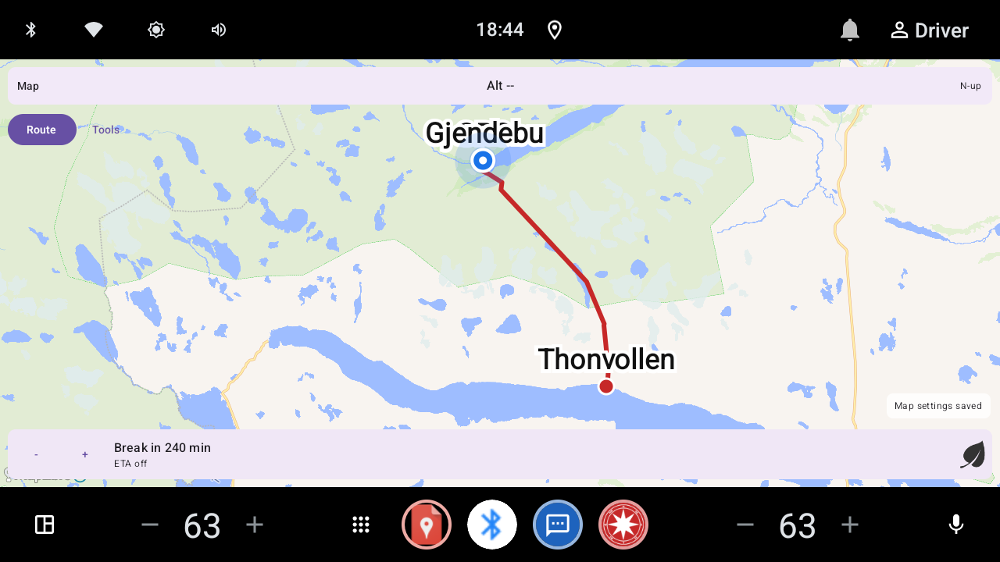 |
| Hamar-løkke, 45° tilt, 3D av |  |
| Hamar-løkke, 45° tilt, 3D på |  |

Kun tilt/3D-demoer — ikke rene strandlinjereferanser. Residual hydro soft-edge
fringe er en [kjent begrensning](map-styles.md#hydro-soft-edge-fringe-known-limitation)
(ubetydelig; venter på
[bekreftelse på ekte maskinvare](real-hardware-testing.md#7-hydro-soft-edge-fringe-emulator-vs-device)).

## Nåværende gate (bunn-HUD)

| Scene | Forhåndsvisning |
|---|---|
| Currently on Mjøsvegen (ø) | 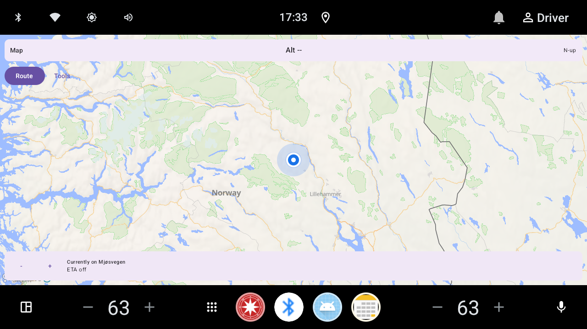 |
| Currently on Trollåsveien (å) |  |
| Currently on Ævongsli (Æ) | 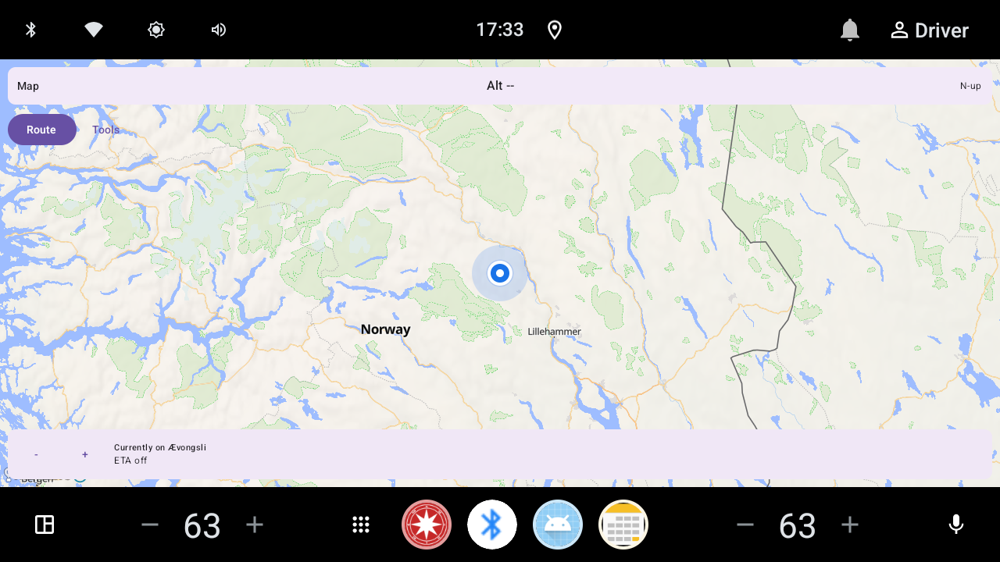 |

Foretrekk `images/terrain/` og nyere HUD-opptak når du sammenligner rutevisual.
Eldre `route_map.png`-kopier var ~57 % MapLibre tom bakgrunn (`#f8f4f0`) fordi
fliser aldri lastet — det er «beige utdatert»-feilmodusen. Regenererte opptak
(tillatelsesliste) viser Liberty/Protomaps-fliser pluss start-/sluttetiketter.
Bleik landfylling i Liberty/Protomaps light-stiler er normalt og er ikke det
samme som tomt-kart-beige.

Start- / via- / slutt**stedsnavn** tegnes som Compose-kartoverlegg (og et
MapLibre waypoints-lag). Skjermbildeteser setter
`NaviMapTestHooks.routeStartLabel` / `routeEndLabel` fordi søkekrom ofte er
skjult med `hideSearchChrome=true`.

## Bevegelige ikoner (APRS-stil)

| Scene | Forhåndsvisning |
|---|---|
| Før flytting | 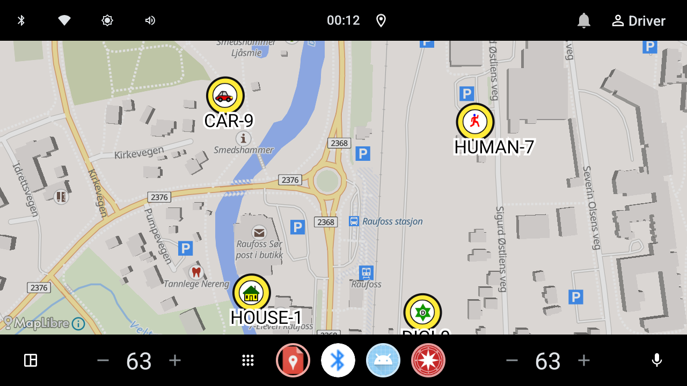 |
| Etter flytting | 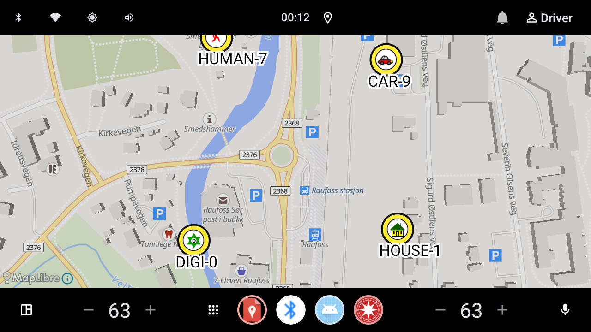 |
| Etter flytting (2) | 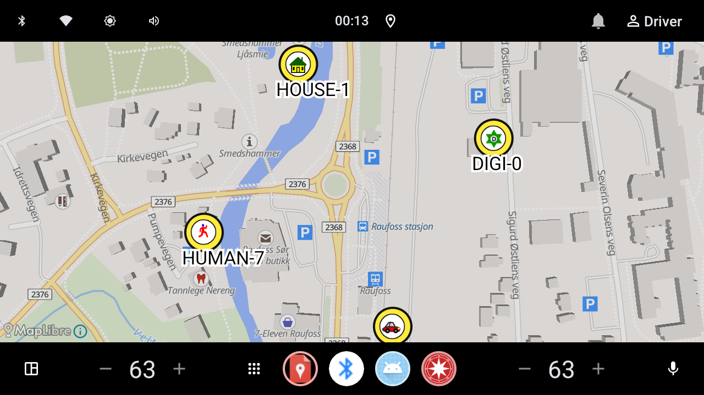 |

## Frakoblet PMTiles-grunnkart / 3D

Dokumentasjon for [`map-styles.md`](map-styles.md). Tatt med
`BasemapPmtilesScreenshotTest` på Automotive-emulatoren (type + terrengfeste +
kamera logget). Kjøre-HUD synlig (`hideUiChrome=false`).

| Scene | Forhåndsvisning |
|---|---|
| Frakoblet Protomaps (Kløfta, 3D av) | 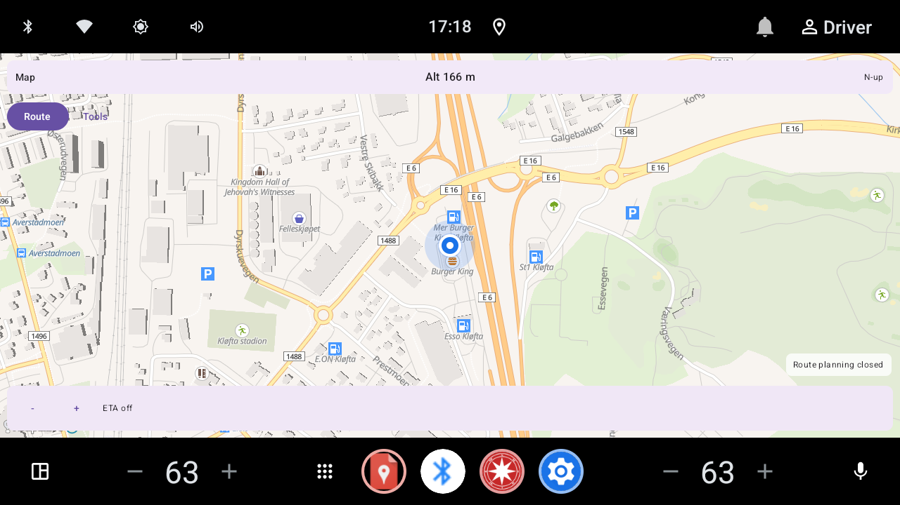 |
| Dekningsgrense → live Liberty (Tromsø) | 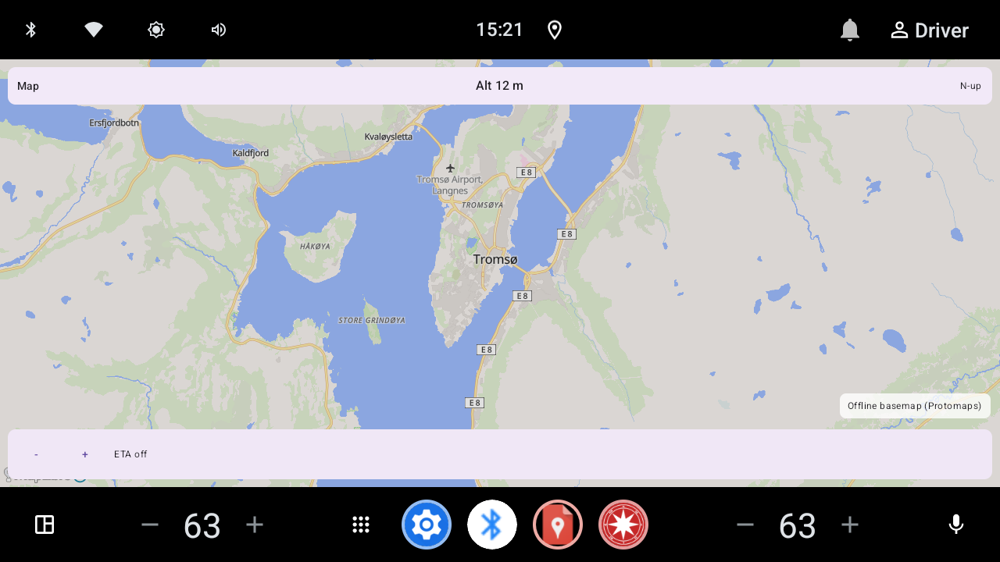 |
| Online 3D (Mapterhorn DEM hillshade, Gjendebu, Jotunheimen) | 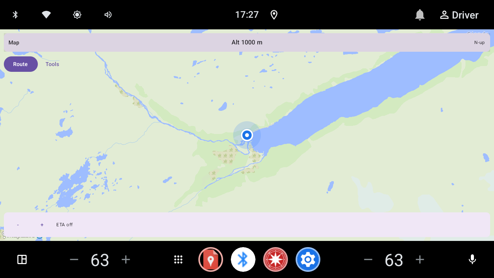 |
| Flatt kart, Gjendebu, Jotunheimen | 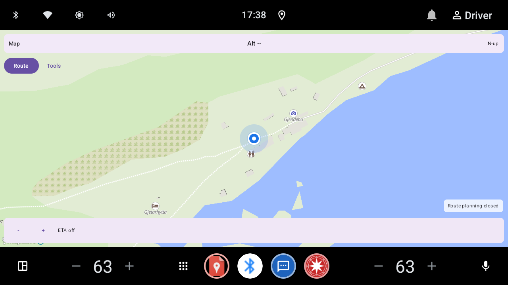 |
