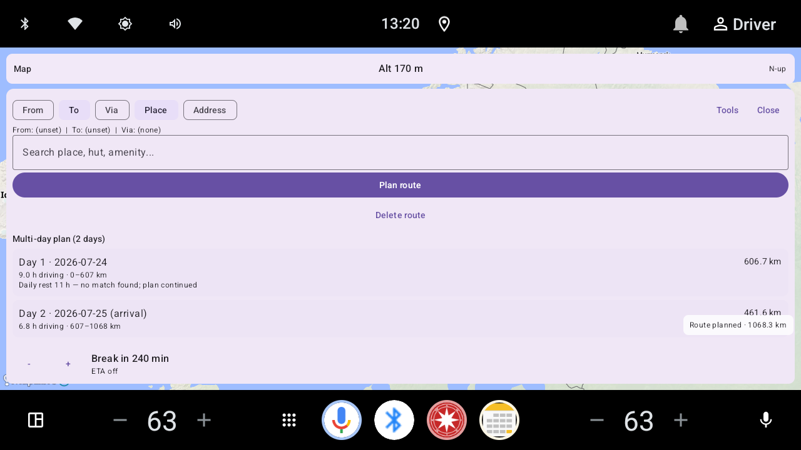

# Pictures

Emulator screenshots for Navi (MapLibre + OpenFreeMap liberty on Android
Automotive).

## GitHub allowlist (space)

**Only** the files listed below may be committed under `docs/images/`.
Extra instrumented-test captures stay on the device / local disk and must not be
added to the repo.

Do **not** use synthetic (hand-drawn / 2-point stub) routes in tests or in any
screenshot that documents routing — corridor geometry must come from a real
planner run (host `raufoss_approach_route`, in-app corridor pipeline, etc.).

Idle HUD bars and the Helgøya → Atnbrua route capture live in the
[README](../README.md#working-app-emulator-screenshots) only
(`docs/images/hud/hud_idle_both_bars.png`,
`docs/images/terrain/hike_eldabu_ramshogda_3d.png`).
Map tilt at 45° (3D off / 3D on) is also shown there
(`docs/images/tilt45_3d_off.png`, `docs/images/tilt45_3d_on.png`).
Current-street UTF-8 evidence (fixture names from Ostlandet place index):
`docs/images/hud/hud_current_street_mjosevegen.png` (ø),
`hud_current_street_trollaas.png` (å),
`hud_current_street_aevongsli.png` (Æ).

Norwegian gallery: [`bilder.md`](bilder.md).

## Map / routing

| Scene | Preview |
|---|---|
| Prekestolen base camp, POI's visible. |  |
| Helgøya → Atnbrua (eco + 3D on, breaks visible) |  |
| Route from Gjendebu to Thonvollen, 3D map. |  |
| Gjendebu to Thonvollen, flat map. |  |
| Hamar loop, 45° tilt, 3D off |  |
| Hamar loop, 45° tilt, 3D on |  |

## Current street (bottom HUD)

Real Østlandet fixture names via `CurrentStreetInstrumentedTest`. See
[`current-street.md`](current-street.md) /
[`unicode-road-names.md`](unicode-road-names.md).

| Scene | Preview |
|---|---|
| Currently on Mjøsvegen (ø) |  |
| Currently on Trollåsveien (å) |  |
| Currently on Ævongsli (Æ) |  |

Prefer `images/terrain/` and recent HUD shots when comparing route visuals.
Older `route_map.png` copies were ~57% MapLibre empty background (`#f8f4f0`)
because tiles never loaded — that is the “beige outdated” failure mode.
Regenerated shots (allowlisted) show Liberty/Protomaps tiles plus start/end
labels. Pale land fill in Liberty/Protomaps light styles is normal and is not
the same as empty-map beige.

Start / via / end **place names** are drawn as a Compose map overlay (and a
MapLibre waypoints layer). Screenshot tests set
`NaviMapTestHooks.routeStartLabel` / `routeEndLabel` because search chrome is
often hidden with `hideSearchChrome=true`.

## Moving icons (APRS-style)

| Scene | Preview |
|---|---|
| Before move |  |
| After move |  |
| After move (2) |  |

## Offline PMTiles basemap / 3D

Evidence for [`map-styles.md`](map-styles.md). Captured by
`BasemapPmtilesScreenshotTest` on the Automotive emulator (kind + terrain
attach + camera logged). Drive HUD bars kept visible (`hideUiChrome=false`).

| Scene | Preview |
|---|---|
| Offline Protomaps (Kløfta, 3D off) |  |
| Coverage boundary → live Liberty (Tromsø) |  |
| Online 3D (Mapterhorn DEM hillshade, Gjendebu, Jotunheimen) |  |
| Flat map, Gjendebu, Jotunheimen |  |

## Multi-day day cards

Captured by `MultiDayDayCardsScreenshotTest` (route tools sheet day list).
Live truck corridor (emulator GPS → Bodø) by `LiveMultiDayDayCardsInstrumentedTest`.

| Scene | Preview |
|---|---|
| Truck multi-day day cards |  |
| Hiking multi-day day cards |  |
| Truck live multi-day day cards (GPS → Bodø) |  |
