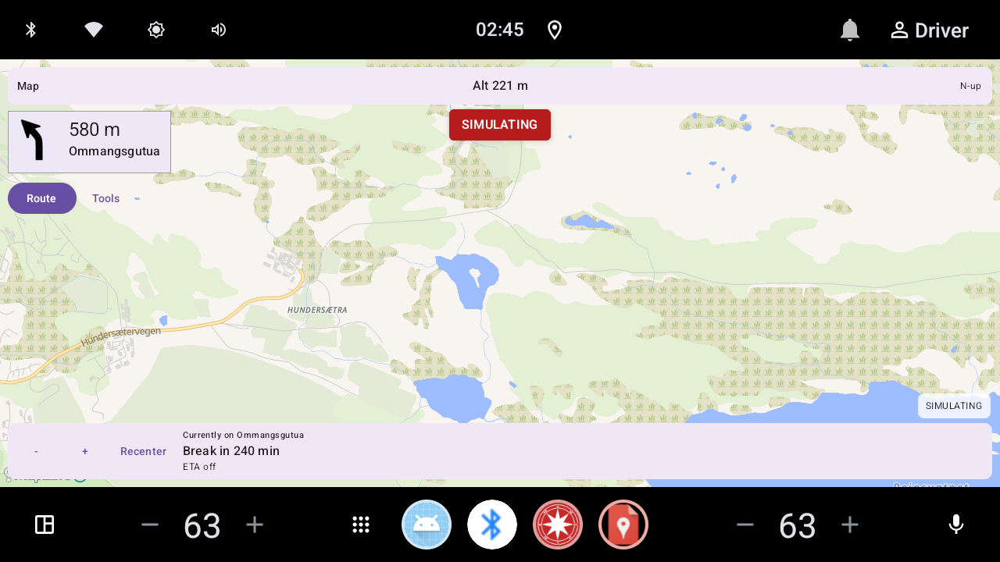
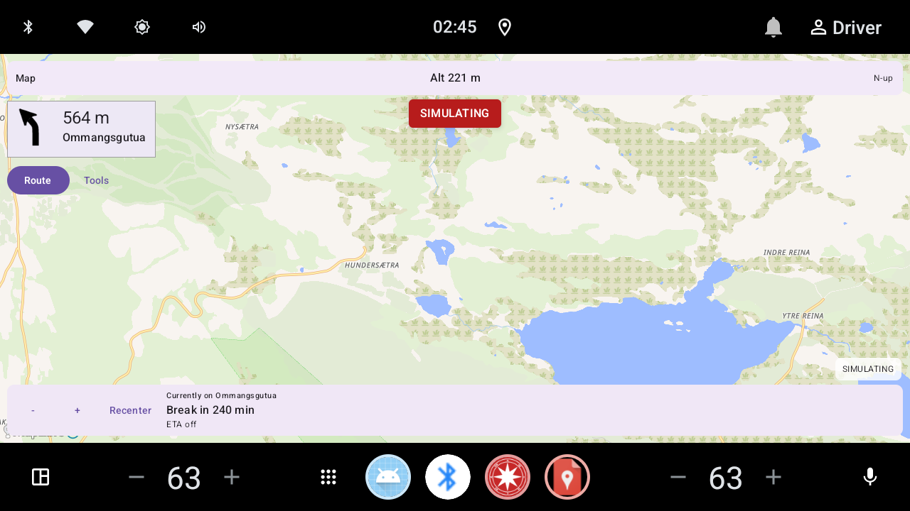
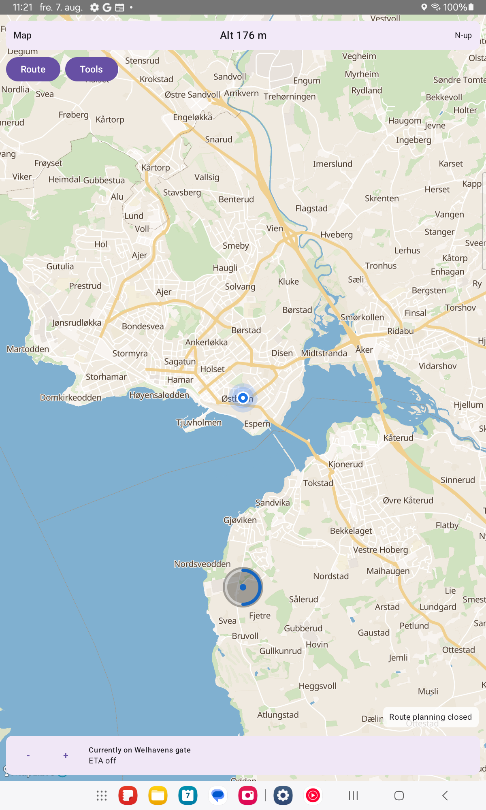
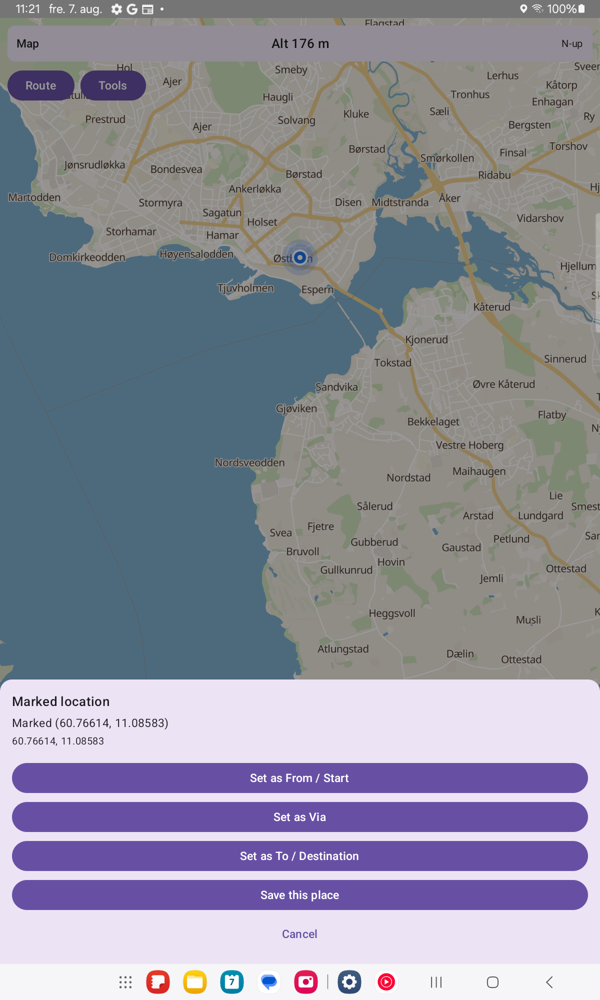
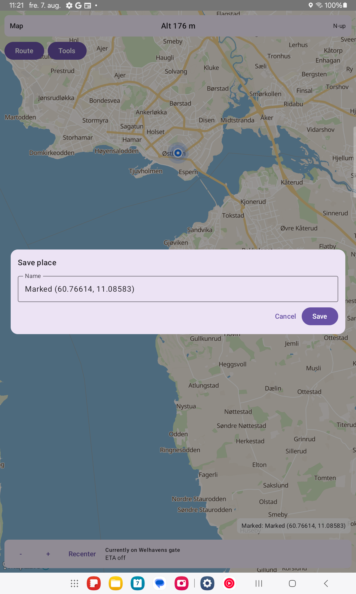
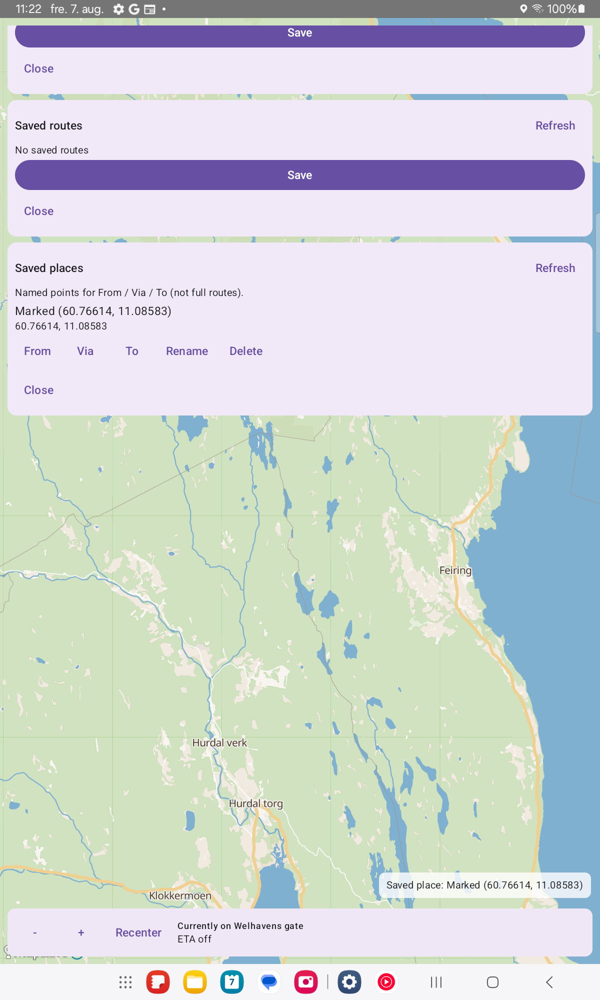
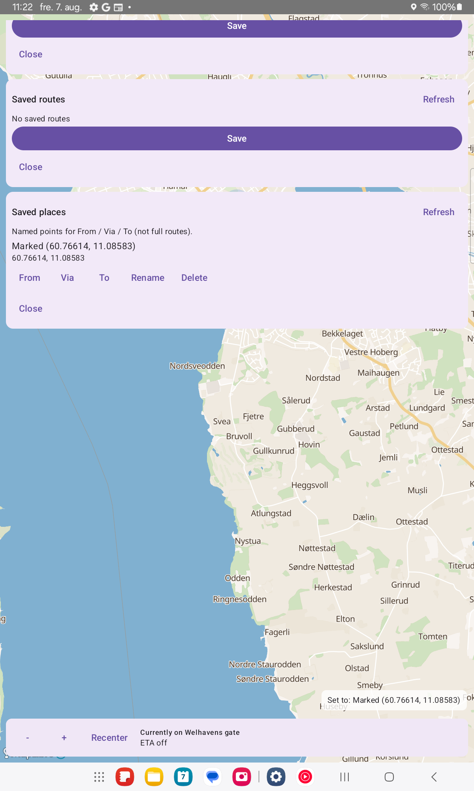

# Pictures

Screenshots for Navi. **Real hardware only** (Samsung Galaxy Tab S6 Lite
SM-P613). Do **not** use the emulator for gallery captures.

Route-following / current-position scenes use the in-app **route simulator**
(red **SIMULATING** banner) along a **real planner-run** corridor. Gallery
frames must **not** reveal the tester’s live GPS position (no live GPS follow
at the physical device location; `disableGpsFollow` for static POI frames).

Coordinates for most captures below were entered via the Route search keyboard
as `lat, lon` (not map-tap). Peak frames that must show basemap amenity/peak
icons at zoom ≥ **16** may also use `NaviMapTestHooks.pendingCamera` /
`GalleryPeakPoiRetakeScreenshotTest` so framing is reliable on hardware.

Basemap amenity / peak icons (not [`poi.md`](poi.md) PoiIndex) need camera
zoom ≥ **16**. OpenFreeMap Liberty tiles include `mountain_peak` (`ele`); Navi
binds that layer at runtime so named peaks can show height online as well as
offline.

Idle HUD bars and the Skolla → Rondvassbu hike overview also appear in the
[README Screenshots](../README.md#screenshots) section
(`docs/images/hud/hud_idle_both_bars.png`,
`docs/images/terrain/hike_eldabu_ramshogda_3d.png`).
Cold-start splash (red open-app mark, Splash Screen API):
`docs/images/splash_open_app.png` (SM-P613; hold with
`am start … --ez navi_keep_splash true`).
Map tilt at 45° (3D off / 3D on) on the Ådalsbruk / Løten loop:
`docs/images/tilt45_3d_off.png`, `docs/images/tilt45_3d_on.png`.
GPS follow / Recenter / rotation evidence (all with **SIMULATING** on the Løten
loop): `docs/images/follow_gps/01_simulating_follow.png` …
`06_rotation_modes_ok.png`.
Current-street UTF-8 evidence:
`docs/images/hud/hud_current_street_mjosevegen.png` (ø),
`hud_current_street_trollaas.png` (å),
`hud_current_street_aevongsli.png` (Æ).

Norwegian gallery: [`bilder.md`](bilder.md).

Capture harness: `GalleryDocsKeyboardCaptureTest` (SM-P613). Pull:
`adb pull /data/local/tmp/navi_gallery_docs/ docs/images/`.

POI online/offline pairs under `docs/images/`:
`poi_jutulhogget.png` / `poi_jutulhogget_offline.png`,
`poi_galdhopiggen_3d.png` / `poi_galdhopiggen_online.png`,
`poi_elgpiggen.png` / `poi_elgpiggen_online.png`,
`poi_prekestolen.png` / `poi_prekestolen_offline.png`.

## Map / routing (documented corridors)

All route-overlay rows were captured on **SM-P613** with **SIMULATING** where a
position marker is shown (except idle HUD / static POI rows). Route-planner
chrome is closed for map-heavy shots (Løten loop, Espa corridor, hiking /
e-bike overlays) so the corridor is visible.

| Scene | Preview |
|---|---|
| Espa → Atnbrufossen (eco / primary corridor), simulating |  |

| Ådalsbruk / Løten loop (simulator + turn instructions), simulating |  |
| Same Løten loop (legacy `route_map.png` slot) |  |
| Finnstad → Søndre Ommang → Rosenlund, 3D on, simulating |  |
| Finnstad → Søndre Ommang → Rosenlund, flat, simulating |  |
| 45° tilt, 3D off, simulating (Løten loop) |  |
| 45° tilt, 3D on, simulating (Løten loop) |  |

Tilt/3D demos. Older gallery PNGs may show a blue hydro soft-edge fringe;
that is a
[screenshot-capture artifact](map-styles.md#hydro-soft-edge-fringe-screenshot-artifact),
not what users see live.

## Single points (keyboard fly-to)

Static map frames after typing WGS84 coordinates into Route search (no live GPS
follow; Route chrome closed before screencap). Opt-in 3D with **45°** camera
tilt and Mapterhorn hillshade where available.

Each landmark has an **online** (Liberty + remote DEM) and **offline**
(Ostlandet Protomaps PMTiles + local DEM) pair when the point falls inside the
installed extract. Preikestolen is outside Ostlandet coverage: preferring
offline still resolves to Liberty 3D (documented fallback row).

Confirm tiles loaded (not beige empty-tile failure mode).

| Scene | Preview |
|---|---|
| Jutulhogget canyon, offline Protomaps 3D |  |
| Galdhøpiggen peak, offline Protomaps 3D (61.6364721, 8.3124426) |  |

## Current street (bottom HUD)

Real Østlandet fixture names via `CurrentStreetInstrumentedTest`. See
[`current-street.md`](current-street.md) /
[`unicode-road-names.md`](unicode-road-names.md).

| Scene | Preview |
|---|---|
| Currently on Mjøsvegen (ø) |  |
| Currently on Trollåsveien (å) |  |
| Currently on Ævongsli (Æ) |  |

## GPS follow / Recenter / rotation

Captured on **SM-P613** during **route simulation** on the Ådalsbruk / Løten
loop (`HardwareGallerySimScreenshotTest` / gallery keyboard harness). Every
frame below must show **SIMULATING** (not live GPS at the tester’s location).

| Scene | Preview |
|---|---|
| Simulating while GPS follow is on |  |
| After pan (follow paused) |  |
| After zoom in |  |
| After zoom out |  |
| After Recenter |  |
| Rotation modes OK |  |

## Map long-press and saved places

How-to: [`map-marking-saved-places.md`](map-marking-saved-places.md). Captured on
**SM-P613** (real touch-and-hold, not emulator).

| Scene | Preview |
|---|---|
| Hold progress ring (~4 s) |  |
| Marked location action sheet |  |
| Save place name dialog |  |
| Saved places list (beside Saved routes) |  |
| Saved place applied as To |  |

## Moving icons (APRS-style)

| Scene | Preview |
|---|---|
| Before move |  |
| After move |  |
| After move (2) |  |

